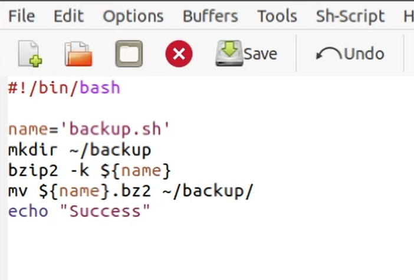
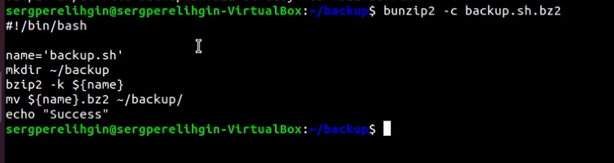
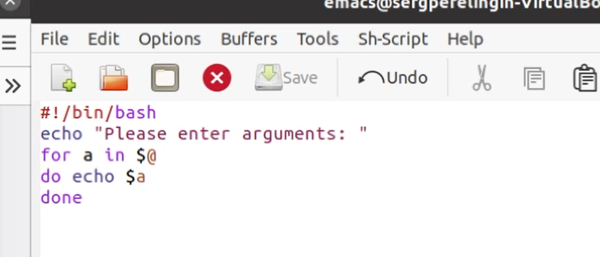
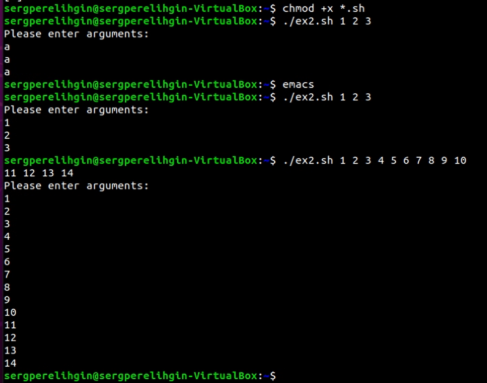
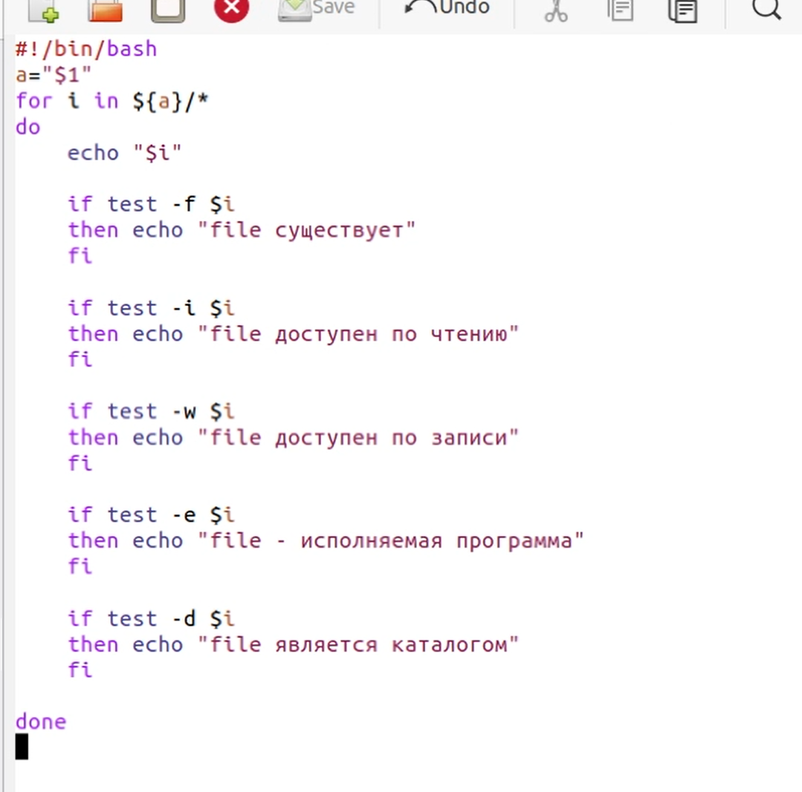
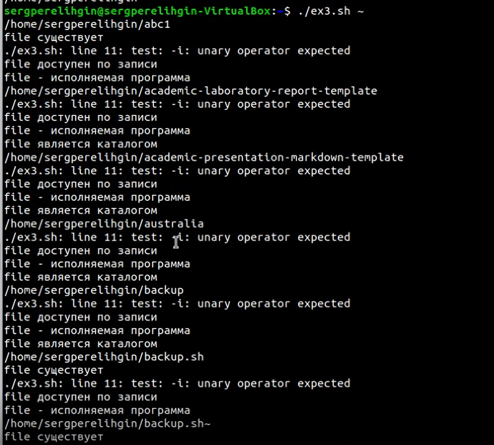
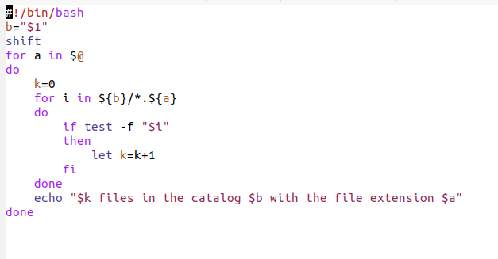
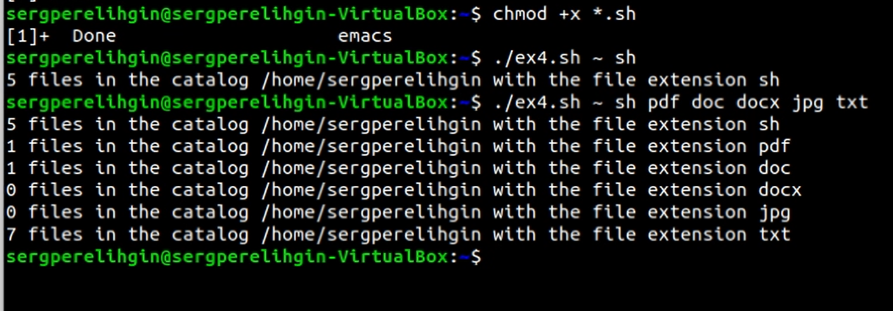

---
## Front matter
lang: ru-RU
title: Отчет по лабораторной работе №11
author: Перелыгин Сергей Викторович

## Formatting
mainfont: PT Serif
romanfont: PT Serif
sansfont: PT Sans
monofont: PT Mono
toc: false
slide_level: 2
theme: metropolis
aspectratio: 43
section-titles: true
---

# Цель работы

## Цель лабораторной работы

Изучить  основы  программирования  в  оболочке  ОС UNIX/Linux. Научиться писать небольшие командные файлы.

# Выполнение лабораторной работы

## Выполнение лабораторной работы

Сначала я записал скрипт, который при запуске будет делать резервную копию самого себя (то есть файла, в котором содержится его исходный код) в другую директорию backup в моем домашнем каталоге. При этом файл должен архивироваться одним из архиваторов на выбор zip, bzip2 или tar. Способ использования команд архивации необходимо узнать, изучив справку.

---

{ #fig:001 width=70% }

---

{ #fig:002 width=70% }

## Выполнение лабораторной работы

Затем я написал пример командного файла, обрабатывающего любое произвольное число аргументов командной строки, в том числе превышающее десять. Напри-мер, скрипт может последовательно распечатывать значения всех переданных аргументов.

---

{ #fig:003 width=70% }

---

{ #fig:004 width=70% }

## Выполнение лабораторной работы

Далее создал командный файл - аналог команды ls (без использования самой этой команды и команды dir). Требовалось, чтобы он выдавал информацию о нужном каталоге и выводил информацию о возможностях доступа к файлам этого каталога.

---

{ #fig:005 width=70% }

---

{ #fig:006 width=70% }

## Выполнение лабораторной работы

После этого я записал командный файл, который получает в качестве аргумента командной строки формат файла (.txt, .doc, .jpg, .pdfи т.д.) и вычисляет количество таких файлов в указанной директории. Путь к директории также передаётся ввиде аргумента командной строки.

---

{ #fig:007 width=70% }

---

{ #fig:008 width=70% }

# Выводы

## Выводы

В ходе выполнения данной лабораторной работы я изучил основы программирования  в  оболочке  ОС UNIX/Linux, а также научился писать небольшие командные файлы.

---
Спасибо за внимание!
