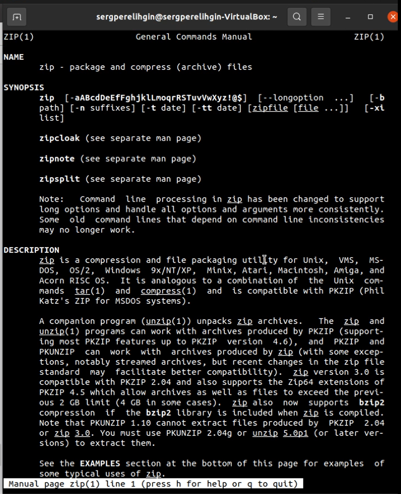
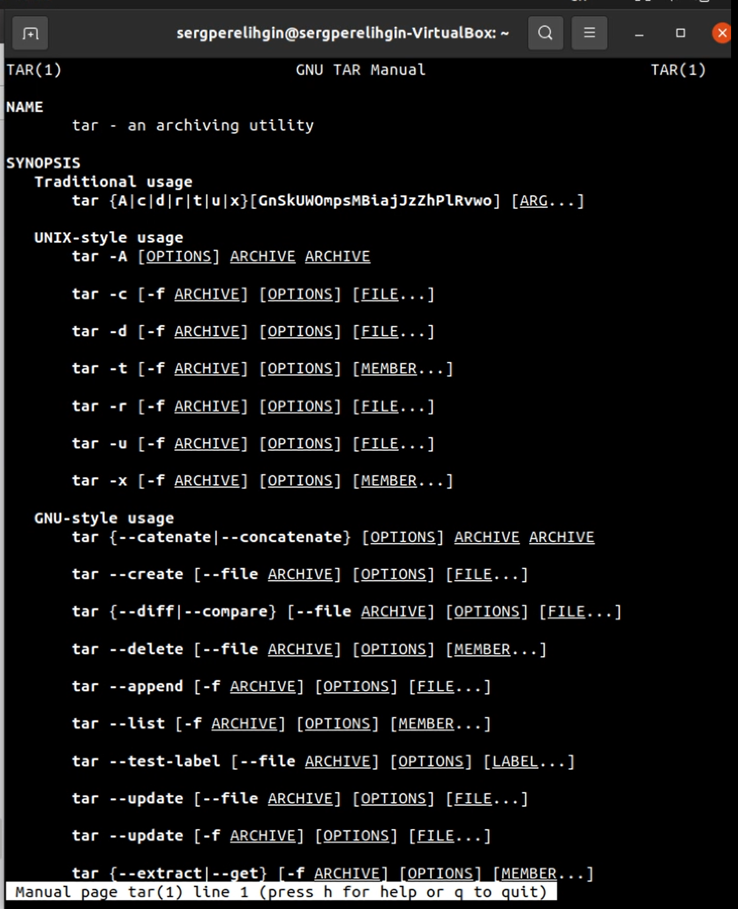
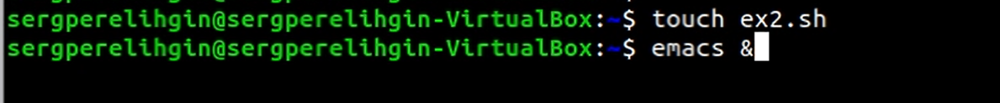

---
## Front matter
lang: ru-RU
title: Отчет по лабораторной работе №10
author: Перелыгин Сергей Викторович

## Formatting
mainfont: PT Serif
romanfont: PT Serif
sansfont: PT Sans
monofont: PT Mono
toc: false
slide_level: 2
theme: metropolis
aspectratio: 43
section-titles: true
---

# Цель работы

## Цель лабораторной работы

Познакомиться с операционной системой Linux. Получить практические навыки работы с редактором Emacs.

# Выполнение лабораторной работы

## Выполнение лабораторной работы

Сначала нужно установить Emacs. Затем запустим его с помощью команды emacs &. Создадем файл lab07.sh с помощью комбинации «Ctrl-x» «Ctrl-f».

---

{ #fig:001 width=70% }

## Выполнение лабораторной работы

В открывшемся буфере наберем необходимый текст. 

---

{ #fig:002 width=70% }

## Выполнение лабораторной работы

Затем мы знакомимся с Emacs, изучаем различные команды в этом редакторе. Я научился редактировать, вставлять, сохранять, удалять, выделять в Emacs.

---

{ #fig:003 width=70% }

## Выполнение лабораторной работы

А также я произвел поиск и замену текста различными способами

{ #fig:004 width=70% }

---

{ #fig:005 width=70% }

# Выводы

## Выводы

в ходе выполнения данной лабораторной работы я познакомился с операционной системой Linux и получил практические навыки работы с редактором Emacs.

---
Спасибо за внимание!
