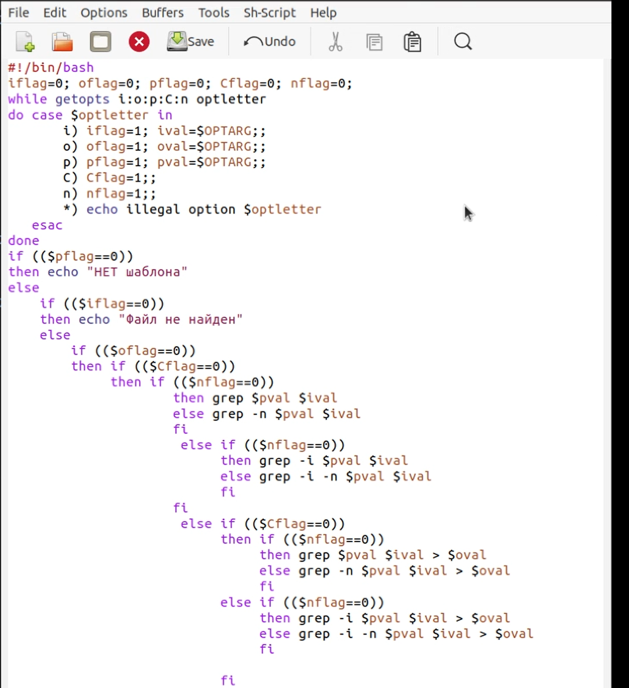
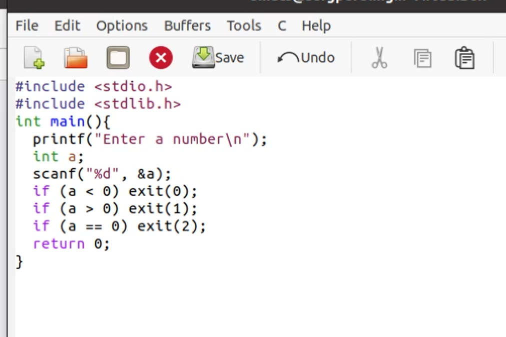
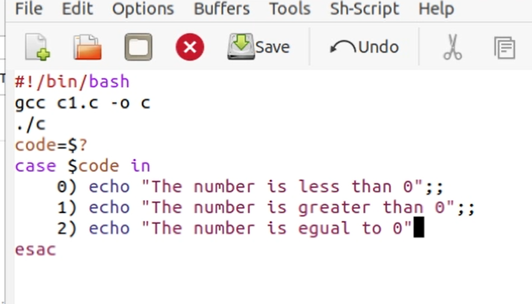
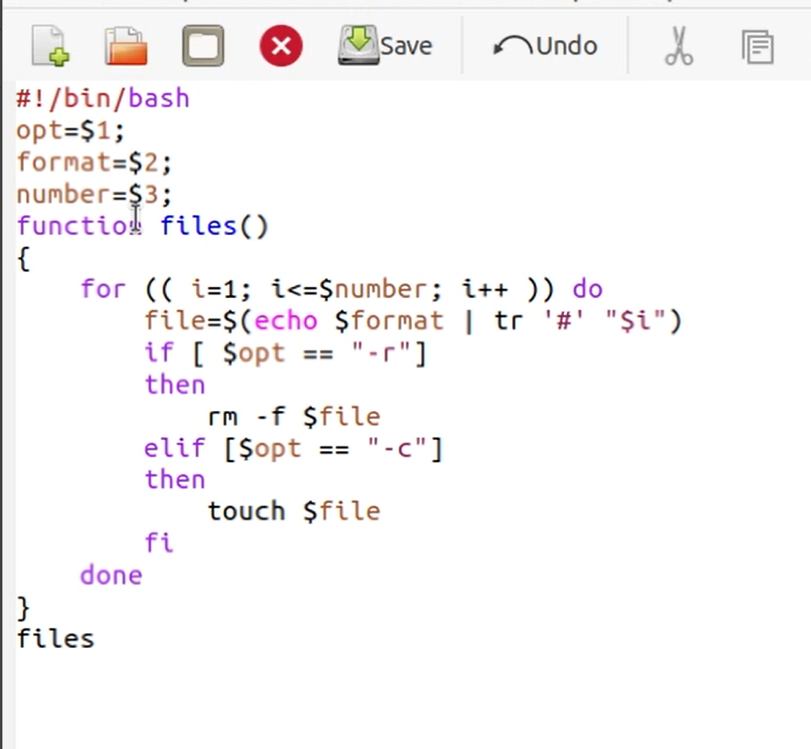
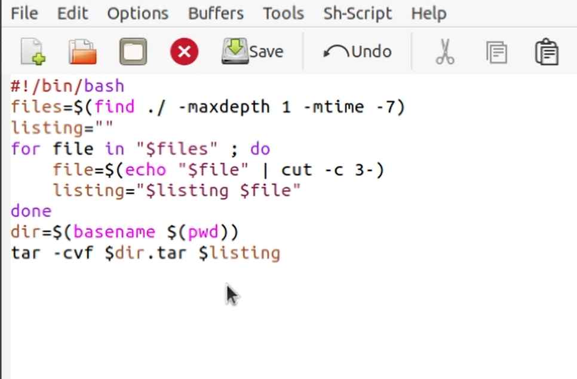

---
## Front matter
lang: ru-RU
title: Отчет по лабораторной работе №12
author: Перелыгин Сергей Викторович

## Formatting
mainfont: PT Serif
romanfont: PT Serif
sansfont: PT Sans
monofont: PT Mono
toc: false
slide_level: 2
theme: metropolis
aspectratio: 43
section-titles: true
---

# Цель работы

## Цель лабораторной работы

Изучить основы программирования в оболочке ОС UNIX. Научится  писать  более  сложные командные  файлы  с  использованием логических управляющих конструкций и циклов.

# Выполнение лабораторной работы

## Выполнение лабораторной работы

Используя команды getopts grep, написал командный файл, который анализирует командную строку с ключами, а затем ищет в указанном файле нужные строки, определяемые ключом -p.

---

{ #fig:001 width=70% }

## Выполнение лабораторной работы

Написал на языке Си программу, которая вводит число и определяет, являетсяли оно больше нуля, меньше нуля или равно нулю. Затем программа завершается с помощью функцииexit(n), передавая информацию в о коде завершения воболочку. Командный файл должен вызывать эту программу и, проанализировавс помощью команды$?, выдать сообщение о том, какое число было введено.

---

{ #fig:002 width=70% }

---

{ #fig:003 width=70% }

## Выполнение лабораторной работы

Написал командный файл, создающий указанное число файлов, пронумерован-ных последовательно от 1 до N(например1.tmp,2.tmp,3.tmp,4.tmpи т.д.).Число файлов, которые необходимо создать, передаётся в аргументы командной строки. Этот же командный файл должен уметь удалять все созданные им файлы (если они существуют).

---

{ #fig:004 width=70% }

## Выполнение лабораторной работы

Написал командный файл, который с помощью команды tar запаковывает в архив все файлы в указанной директории. Модифицировал его так, чтобы запаковывались только те файлы, которые были изменены менее недели тому назад(использовать командуfind).

---

{ #fig:005 width=70% }

# Выводы

## Выводы

В  ходе  выполнения  данной  лабораторной  работы  я  изучил основы программирования в оболочке ОС UNIX и научился писать более сложные командные файлы с использованием логических управляющих конструкций и циклов.

---
Спасибо за внимание!
