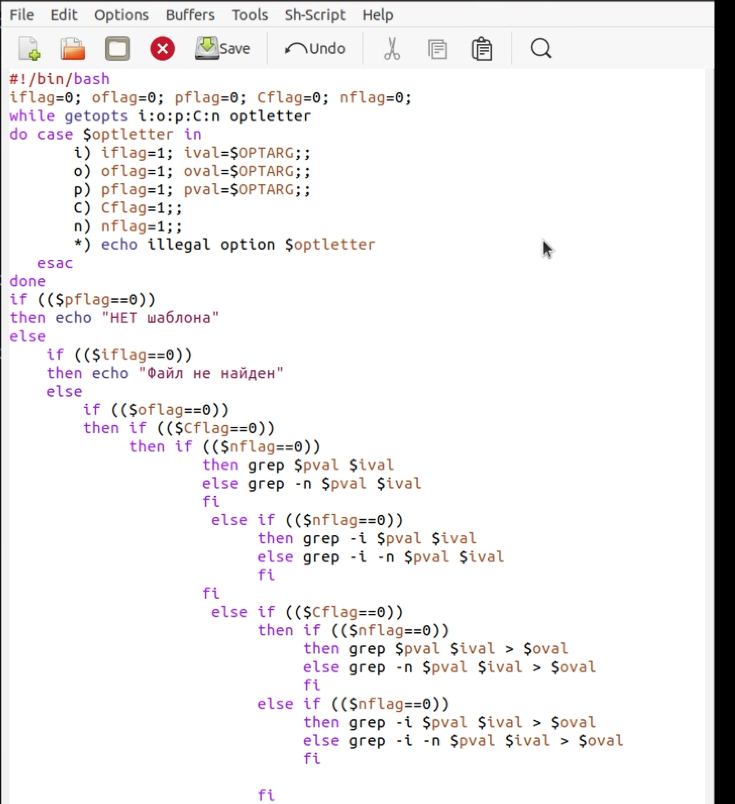

---
# Front matter
lang: ru-RU
title: "Отчёт по лабораторной работе № 12"
author: "Перелыгин Сергей Викторович"

# Formatting
toc-title: "Содержание"
toc: true # Table of contents
toc_depth: 2
lof: true # List of figures
fontsize: 12pt
linestretch: 1.5
papersize: a4paper
documentclass: scrreprt
polyglossia-lang: russian
polyglossia-otherlangs: english
mainfont: PT Serif
romanfont: PT Serif
sansfont: PT Sans
monofont: PT Mono
mainfontoptions: Ligatures=TeX
romanfontoptions: Ligatures=TeX
sansfontoptions: Ligatures=TeX,Scale=MatchLowercase
monofontoptions: Scale=MatchLowercase
indent: true
pdf-engine: lualatex
header-includes:
  - \linepenalty=10 # the penalty added to the badness of each line within a paragraph (no associated penalty node) Increasing the value makes tex try to have fewer lines in the paragraph.
  - \interlinepenalty=0 # value of the penalty (node) added after each line of a paragraph.
  - \hyphenpenalty=50 # the penalty for line breaking at an automatically inserted hyphen
  - \exhyphenpenalty=50 # the penalty for line breaking at an explicit hyphen
  - \binoppenalty=700 # the penalty for breaking a line at a binary operator
  - \relpenalty=500 # the penalty for breaking a line at a relation
  - \clubpenalty=150 # extra penalty for breaking after first line of a paragraph
  - \widowpenalty=150 # extra penalty for breaking before last line of a paragraph
  - \displaywidowpenalty=50 # extra penalty for breaking before last line before a display math
  - \brokenpenalty=100 # extra penalty for page breaking after a hyphenated line
  - \predisplaypenalty=10000 # penalty for breaking before a display
  - \postdisplaypenalty=0 # penalty for breaking after a display
  - \floatingpenalty = 20000 # penalty for splitting an insertion (can only be split footnote in standard LaTeX)
  - \raggedbottom # or \flushbottom
  - \usepackage{float} # keep figures where there are in the text
  - \floatplacement{figure}{H} # keep figures where there are in the text
---

# Цель работы

Изучить основы программирования в оболочке ОС UNIX. Научится  писать  более  сложные командные  файлы  с  использованием логических управляющих конструкций и циклов.

# Выполнение лабораторной работы

1. Используя команды getopts grep, написал командный файл, который анализирует командную строку с ключами: 
* -iinputfile - прочитать данные из указанного файла; 
* -ooutputfile - вывести данные в указанный файл; 
* -pшаблон - указать шаблон для поиска; 
* -C - различать большие и малые буквы; 
* -n - выдавать номера строк, а затем ищет в указанном файле нужные строки, определяемые ключом –p. Для  данной  задачи  я  создал  файл ex1.sh(Рисунки 1) и  написал соответствующие скрипты.

{ #fig:001 width=70% }

Далее  я  проверил работу написанного скрипта,  используя  различные опции (например, команда «./ex1.sh – I a1.txt–o a2.txt–p UNIX –C-n»), предварительнодобавив право на исполнение файла (команда «chmod +x ex1.sh») и  создав  2  файла,  которые  необходимы  для  выполнения программы: a1.txt и a2.txt(Рисунок 2)

{ #fig:002 width=70% }

Скрипт работает корректно.

2. Написал на языке Си программу, которая вводит число и определяет, является  ли  оно  больше  нуля,  меньше  нуля  или  равно  нулю.  Затем программа  завершается  с  помощью  функции exit(n),  передавая информацию в о коде завершения в оболочку. Командный файл должен вызывать  эту  программу  и,  проанализировав  с  помощью  команды  $?, выдать сообщение о том, какое число было введено. Для  данной  задачи  я  создал  2  файла: c1.c (Рисунок 3) и c1.sh(Рисунок 4)и написал соответствующие скрипты.

{ #fig:003 width=70% }

{ #fig:004 width=70% }

Далее я проверил работу написанных скриптов (команда «./c1.sh»), предварительно добавив право на исполнение файла (команда «chmod +x c1.sh») (Рисунок 5). Скрипты работают корректно.

{ #fig:005 width=70% }

3.  Написал командный  файл,  создающий  указанное  число  файлов, пронумерованных  последовательно  от  1  до N. Число файлов, которые необходимо создать, передаётся в аргументы командной строки. Этот же командный файл должен уметь удалять все созданные им файлы (если они существуют). Для  данной  задачи  я  создал  файл: ex3.sh(Рисунок 6)и  написал соответствующий скрипт.

{ #fig:006 width=70% }

Далее  я  проверил  работу  написанного  скрипта, предварительно добавив право на исполнение файла (команда «chmod +x ex3.sh»). Сначала я создал три файла (команда «./ex3.sh –c abc#.txt 3»), удовлетворяющие условию задачи, а потом удалил их (команда «./ex3.sh –r abc#.txt 3»)(Рисунок7)

{ #fig:007 width=70% }

4.  Написал командный  файл,  который  с  помощью  команды tar запаковывает в архив все файлы в указанной директории. Модифицировал его так, чтобы запаковывались только те файлы, которые были изменены менее недели тому назад (использовать команду find). Для  данной  задачи  я  создал  файл: ex4.sh(Рисунок 8) и  написал соответствующий скрипт.

{ #fig:008 width=70% }

Далее я проверил работу написанного скрипта, предварительно  добавив  право  на  исполнение файла  (команда «chmod +x ex4.sh»)и  создав  отдельный Catalog1  с несколькими файлами. Скрипт работает корректно.

{ #fig:009 width=70% }

# Ответы на контрольные вопросы

1) Команда getopts осуществляет синтаксический анализ командной строки, выделяя флаги, ииспользуется для объявления переменных. Синтаксис команды следующий:

getopts option-string variable [arg...]

Флаги - это опции командной строки, обычно помеченные знаком минус; Например,для команды ls флагом может являться -F.

Строка опций option-string - эт осписок возможных букв и чисел соответствующего флага. Если ожидается, что некоторый флаг будет сопровождаться некоторым аргументом, то за символом, обозначающим этот флаг, должно следовать двоеточие. Соответствующей переменной присваивается буква данной опции. Еслик оманда getopts может распознать аргумент, то она возвращает истину. Принято включать getopts в цикл while и анализировать введённые данные с помощью оператора case. 

Функция getopts включает две специальные переменные среды -OPTARG и OPTIND. Если ожидается доплнительное значение,то OPTARG устанавливается в значение этого аргумента.

Функция getopts также понимает переменные типа массив, следовательно, можно использовать её в функции не только для синтаксического анализа аргументов функций, но и для анализа введённых пользователем данных.

2) Приперечислении имён файлов текущего каталога можно использовать следующие символы:

1. *-соответствует произвольной, в том числе и пустой строке;

2. ?-соответствует любому одинарному символу;

3. [c1-c2] - соответствует любому символу, лексикографически находящемуся между символами с1 и с2.

Например,

1.1. echo* - выведет имена всех файлов текущего каталога, что представляет собой простейший аналог команды ls;

1.2. ls*.c-выведет все файлы с последними двумя символами, совпадающими с.c.

1.3. echoprog.?-выведет все файлы, состоящие из пяти или шести символов, первыми пятью символами которых являются prog..

1.4. [a-z]*-соответствует произвольному имени файла в текущем каталоге, начинающемуся с любой строчной буквы латинского алфавита.

3) Часто бывает необходимо обеспечить проведение каких-либо действий циклически и управление дальнейшими действиями в зависимости от результатов проверки некоторого условия. Для решения подобных задач язык программирования bash предоставляет возможность использовать такие управляющие конструкции, как for, case, if и while. С точки зрения командного процессора эти управляющие конструкции являются обычными командами и могут использоваться как при создании командных файлов, так и при работе в интерактивном режиме. Команды,реализующие подобные конструкции, по сути, являются операторами языка программирования bash. Поэтому при описании языка программирования bash термин оператор будет использоваться наравне с термином команда.

Команды ОСUNIX возвращают код завершения, значение которого может быть использовано для принятия решения о дальнейших действиях.

Команда test, например, создана специально для использования в командных файлах. Единственная функция этой команды заключается в выработке кода завершения.

4) Два несложных способа позволяют вам прерывать циклы в оболочке bash. 

Команда break завершает выполнение цикла, а команда continue завершает данную итерацию блока операторов. 

Команда break полезна для завершения цикла while в ситуациях, когда условие перестаёт быть правильным. 

Команда continue используется в ситуациях, когда больше нет необходимости выполнять блок операторов, но вы можете захотеть продолжить проверять данный блок на других условных выражениях.

5) Следующие две команды ОСUNIX используются только совместно с управляющими конструкциями языка программирования bash: это команда true,которая всегда возвращает код завершения, равный нулю(т.е.истина),и команда false,которая всегда возвращает код завершения,неравный нулю(т.е.ложь).Примеры бесконечных циклов:

while true

	do echo hello andy 
	
done 

until false 

	do echo hello mike 

done

6) Строка iftest-fman$s/$i.$s проверяет,существует ли файл man$s/$i.$s и является ли этот файл обычным файлом.Если данный файл является каталогом,то команда вернет нулевое значение(ложь).

7) Выполнение оператора цикла while сводится к тому,что сначала выполняется последовательность команд(операторов),которую задаёт список-команд в строке,содержащей служебное слово while,а затем,если последняя выполненная команда из этой последовательности команд возвращает нулевой код завершения(истина),выполняется последовательность команд(операторов),которую задаёт список-команд в строке,содержащей служебное слово do,после чего осуществляется безусловный переход на начало оператора цикла while. Выход из цикла будет осуществлён тогда,когда последняя выполненная команда из последовательности команд (операторов),которую задаёт список-команд в строке,содержащей служебное слово while, возвратит ненулевой код завершения(ложь). 

При замене в операторе цикла while служебного слова while на until условие,при выполнении которого осуществляется выход из цикла,меняется на противоположное.В остальном оператор цикла while и оператор цикла until идентичны.

# Выводы

В  ходе  выполнения  данной  лабораторной  работы  я  изучил основы программирования в оболочке ОС UNIX и научился писать более сложные командные файлы с использованием логических управляющих конструкций и циклов.

# Библиография

* Кулябов Д.С. Операционные системы: лабораторные работы: учебное пособие / Д.С. Кулябов, М.Н. Геворкян, А.В. Королькова, А.В. Демидова. — М. : Изд-во РУДН, 2016. — 117 с. — ISBN 978-5-209-07626-1 : 139.13; То же [Электронный ресурс]. — URL: http://lib.rudn.ru/MegaPro2/Download/MObject/6118.
* Робачевский А.М. Операционная система UNIХ [текст] : Учебное пособие / А.М. Робачевский, С.А. Немнюгин, О.Л. Стесик. — 2-е изд., перераб. и доп. — СПб. : БХВ-Петербург, 2005, 2010. — 656 с. : ил. — ISBN 5-94157-538-6 : 164.56. (ЕТ 60)
* Таненбаум Эндрю. Современные операционные системы [Текст] / Э. Таненбаум. — 2-е изд. — СПб. : Питер, 2006. — 1038 с. : ил. — (Классика Computer Science). — ISBN 5-318-00299-4 : 446.05. (ЕТ 50)
* Ван Стеен М., Эндрю Таненбаум Распределенные системы. Принципы и парадигмы [Текст] / Э. Таненбаум, в.М. Стеен. — СПб. : Питер, 2003. — 877 с. : ил. — (Классика Computer science). — ISBN 5-272-00053-6 : 377.52. (ЕТ 50)
* Сафонов, В.О. Основы современных операционных систем : учебное пособие / В.О. Сафонов. — Москва : Интернет-Университет Информационных Технологий, 2011. — 584 с. — (Основы информационных технологий). — ISBN 978-5-9963-0495-0 ; То же [Электронный ресурс]. — URL: http://biblioclub.ru/index.php?page=book&id=233210.
* Немет Эви. UNIX — руководство системного администратора [Текст] / Э. Немет, Г. Снайдер, С. Сибасс; Э.Немет, Г.Снайдер, С.Сибасс, Х.Р.Трент. — 3-е изд. — СПб. : Питер, 2004. — 925 с. : ил. — (Для профессионалов). — ISBN 0-13-020601-6. — ISBN 5-318-00754-6 : 280.00. (ЕТ 30)
* Бек Л. Введение в системное программирование [Текст] / Л. Бек; Пер. с англ. Н.А.Богомолова, В.М.Вязовского и С.Е.Морковина; Под ред. Л.Н.Королева. — М. : Мир, 1988. — 448 с. : ил. — ISBN 5-03-000011-9 : 2.60. (ЕТ 3)
* Дьяконов Владимир Юрьевич. Системное программирование [Текст] : Учебное пособие для втузов / В.Ю. Дьяконов, В.А. Китов, И.А. Калинчев; Под ред. А.Л.Горелика. — М. : Высшая школа, 1990. — 221 с. : ил. — ISBN 5-06-000732-4 : 0.55.

