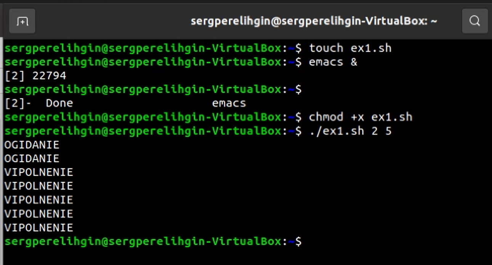
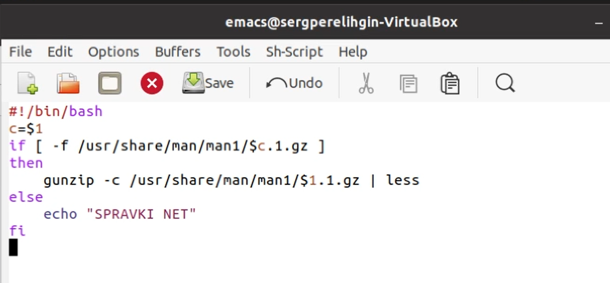
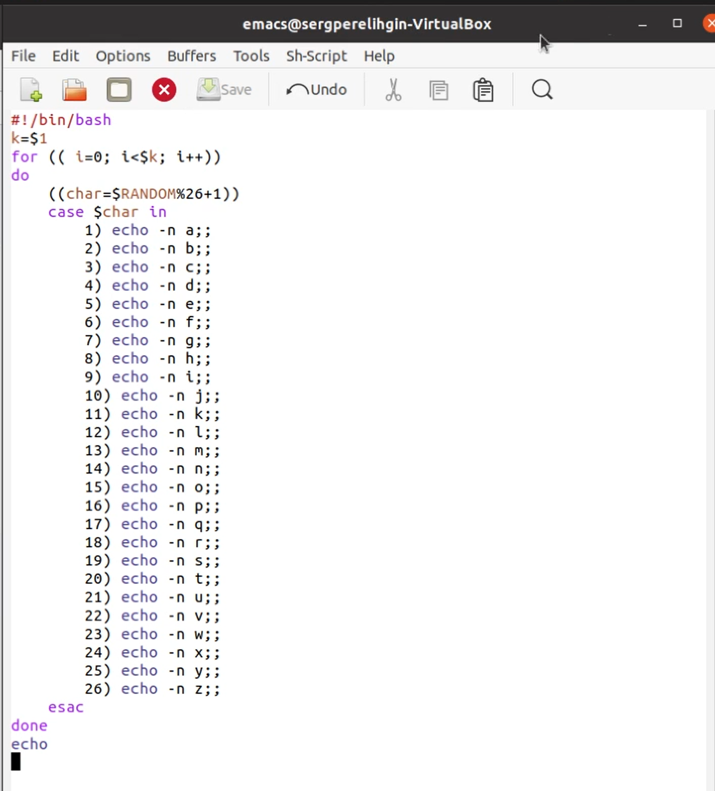
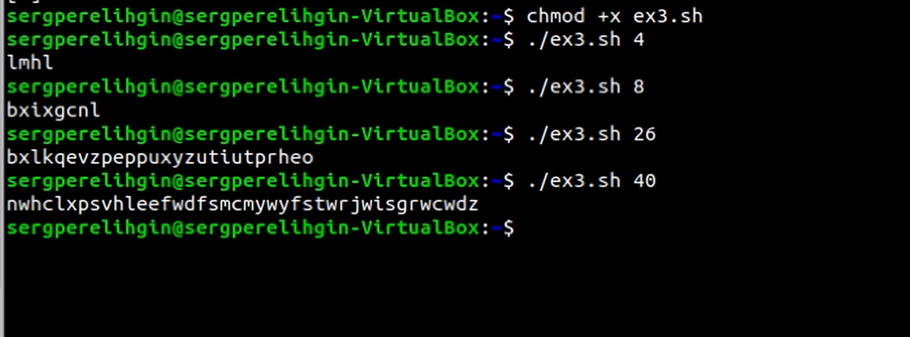

---
## Front matter
lang: ru-RU
title: Отчет по лабораторной работе №13
author: Перелыгин Сергей Викторович

## Formatting
mainfont: PT Serif
romanfont: PT Serif
sansfont: PT Sans
monofont: PT Mono
toc: false
slide_level: 2
theme: metropolis
aspectratio: 43
section-titles: true
---

# Цель работы

## Цель лабораторной работы

Изучить основы программирования в оболочке ОС UNIX. Научиться писать более сложные командные файлы с использованием логических управляющих конструкций и циклов.

# Выполнение лабораторной работы

## Выполнение лабораторной работы

Сначала я реализовал упрощенный механизм семафора, писал скрипт в редакторе emacs.

{ #fig:001 width=70% }

## Выполнение лабораторной работы

Затем я изучил содерджимое каталога /usr/share/man/man1 и написал скрипт, выводящий справку о команде или сообщение об отсутствии справки к этой команде.

{ #fig:002 width=70% }

## Выполнение лабораторной работы

После этого я реализовал командный файл, который, используя встроенную переменную $RANDOM, генерирует случайную последовательность букв латинского алфавита. 

{ #fig:003 width=45% }

---

{ #fig:004 width=70% }

# Выводы

## Выводы

В ходе выполнения данной лабораторной работы я изучил основы
программирования в оболочке ОС UNIX, а также научился писать более
сложные командные файлы с использованием логических управляющих
конструкций и циклов.

---
Спасибо за внимание!
