---
# Front matter
lang: ru-RU
title: "Отчёт по лабораторной работе № 13"
author: "Перелыгин Сергей Викторович"

# Formatting
toc-title: "Содержание"
toc: true # Table of contents
toc_depth: 2
lof: true # List of figures
fontsize: 12pt
linestretch: 1.5
papersize: a4paper
documentclass: scrreprt
polyglossia-lang: russian
polyglossia-otherlangs: english
mainfont: PT Serif
romanfont: PT Serif
sansfont: PT Sans
monofont: PT Mono
mainfontoptions: Ligatures=TeX
romanfontoptions: Ligatures=TeX
sansfontoptions: Ligatures=TeX,Scale=MatchLowercase
monofontoptions: Scale=MatchLowercase
indent: true
pdf-engine: lualatex
header-includes:
  - \linepenalty=10 # the penalty added to the badness of each line within a paragraph (no associated penalty node) Increasing the value makes tex try to have fewer lines in the paragraph.
  - \interlinepenalty=0 # value of the penalty (node) added after each line of a paragraph.
  - \hyphenpenalty=50 # the penalty for line breaking at an automatically inserted hyphen
  - \exhyphenpenalty=50 # the penalty for line breaking at an explicit hyphen
  - \binoppenalty=700 # the penalty for breaking a line at a binary operator
  - \relpenalty=500 # the penalty for breaking a line at a relation
  - \clubpenalty=150 # extra penalty for breaking after first line of a paragraph
  - \widowpenalty=150 # extra penalty for breaking before last line of a paragraph
  - \displaywidowpenalty=50 # extra penalty for breaking before last line before a display math
  - \brokenpenalty=100 # extra penalty for page breaking after a hyphenated line
  - \predisplaypenalty=10000 # penalty for breaking before a display
  - \postdisplaypenalty=0 # penalty for breaking after a display
  - \floatingpenalty = 20000 # penalty for splitting an insertion (can only be split footnote in standard LaTeX)
  - \raggedbottom # or \flushbottom
  - \usepackage{float} # keep figures where there are in the text
  - \floatplacement{figure}{H} # keep figures where there are in the text
---

# Цель работы

Изучить основы программирования в оболочке ОС UNIX. Научиться писать более сложные командные файлы с использованием логических управляющих конструкций и циклов.

# Выполнение лабораторной работы

1. Написал командный файл, реализующий упрощённый механизм семафоров. Командный файл должен в течение некоторого времени t1 дожидаться освобождения ресурса, выдавая об этом сообщение, а дождавшись его освобождения, использовать его в течение некоторого времени t2<>t1, также выдавая информацию о том, что ресурс используется соответствующим командным файлом (процессом).
Для данной задачи я создал файл: ex1.sh (Рисунок 1) и написал
соответствующий скрипт.

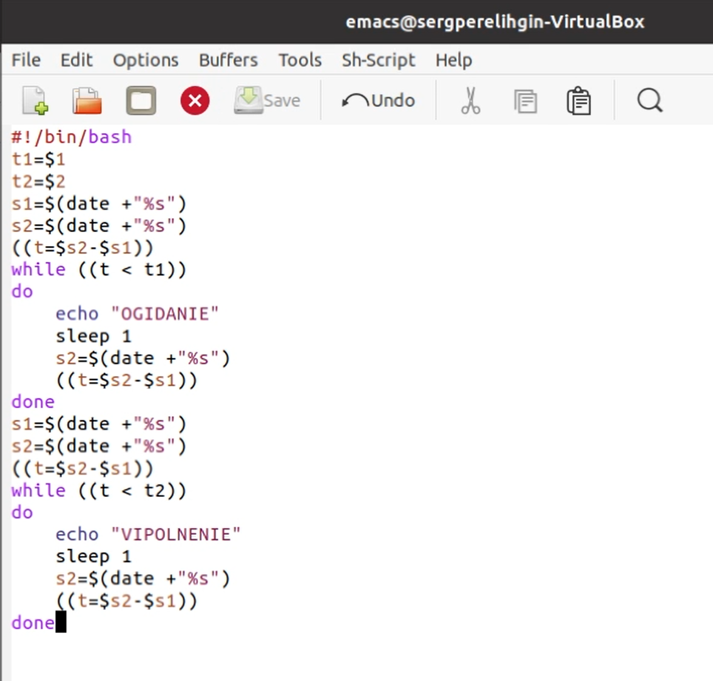{ #fig:001 width=70% }

Далее я проверил работу написанного скрипта (команда «./ex1.sh 2 5»), предварительно добавив право на исполнение файла (команда «chmod +x
ex1.sh») (Рисунок 2). Скрипт работает корректно.

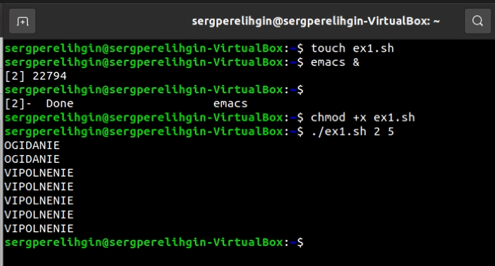{ #fig:002 width=70% }

После этого я изменил скрипт так, чтобы его можно было выполнять в нескольких терминалах и проверил его работу (Рисунки 3, 4, 5, 6, 7). К сожалению при вводе любых команд, не получилось достичь желаемого результата, выводится сообщение "Permission denied", то есть отказ в доступе.

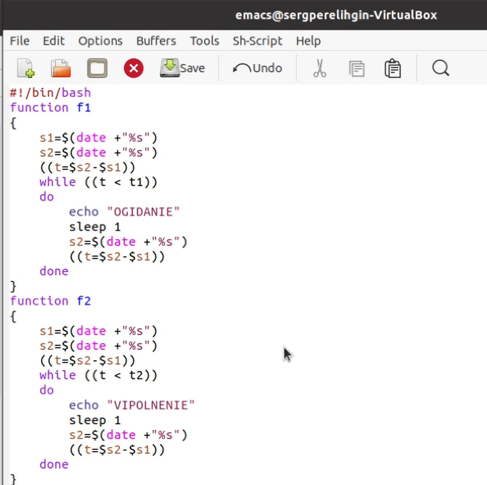{ #fig:003 width=70% }

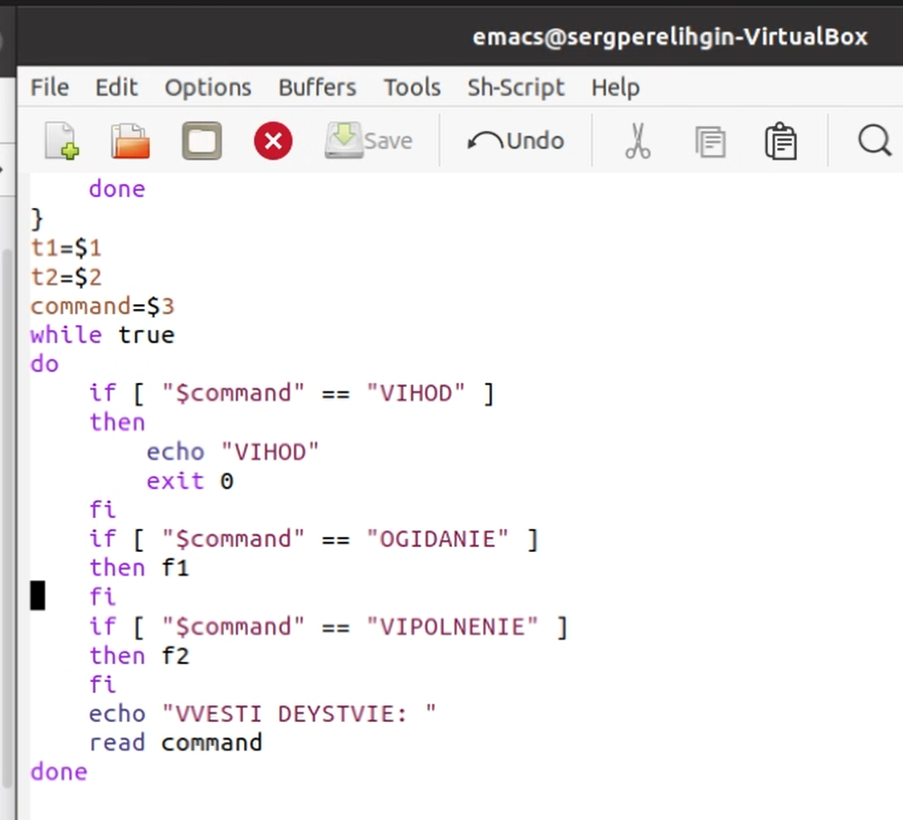{ #fig:004 width=70% }

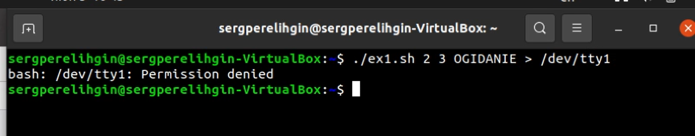{ #fig:005 width=70% }

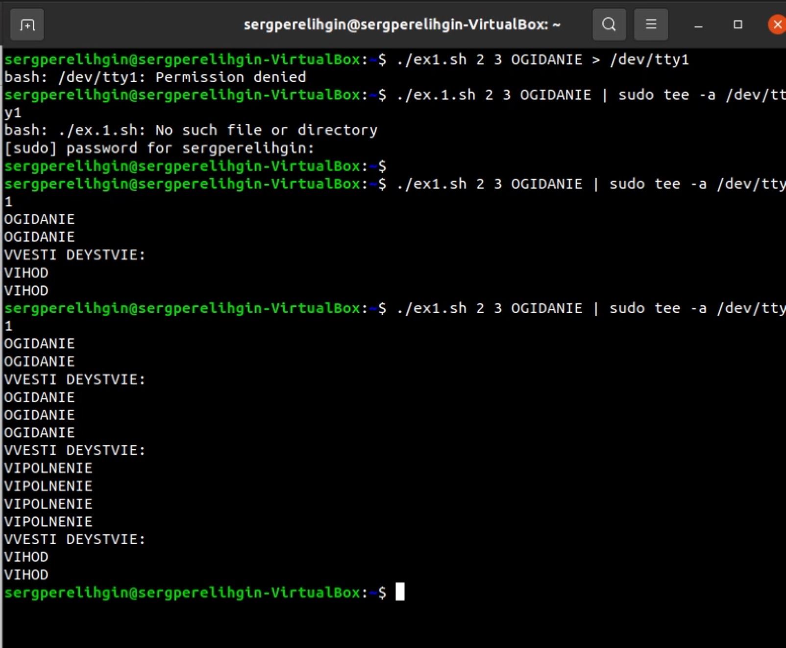{ #fig:006 width=70% }

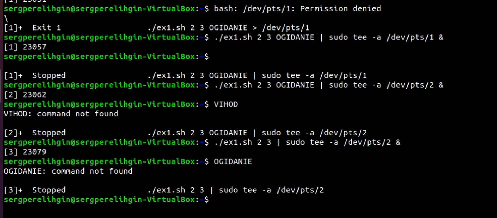{ #fig:007 width=70% }

2. Реализовал команду man с помощью командного файла. Изучил содержимое каталога /usr/share/man/man1 (Рисунок 8). В нем находятся архивы текстовых файлов, содержащих справку по большинству установленных в системе программ и команд. Каждый архив можно открыть командой less сразу же просмотрев содержимое справки. Командный файл должен получать в виде аргумента командной строки название команды и в виде результата
выдавать справку об этой команде или сообщение об отсутствиисправки, если соответствующего файла нет в каталоге man1.

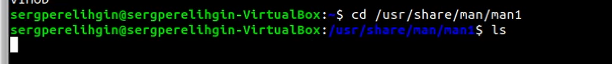{ #fig:008 width=70% }

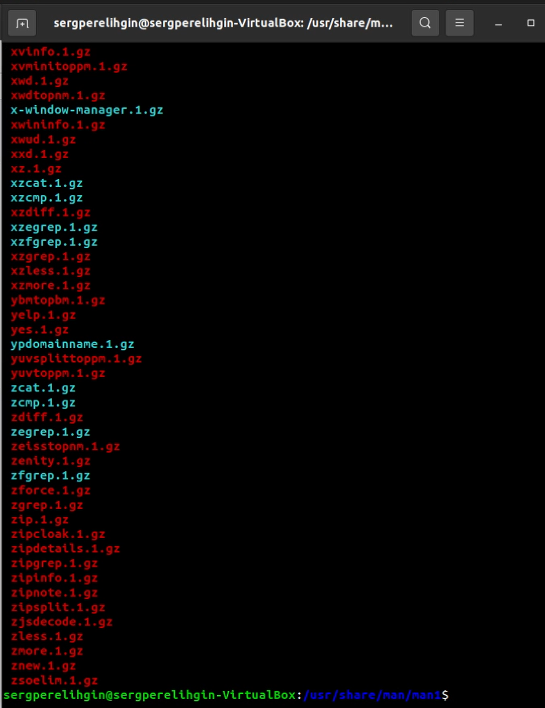{ #fig:009 width=70% }

Для данной задачи я создал файл: ex2.sh (Рисунок 10) и написал соответствующий скрипт.

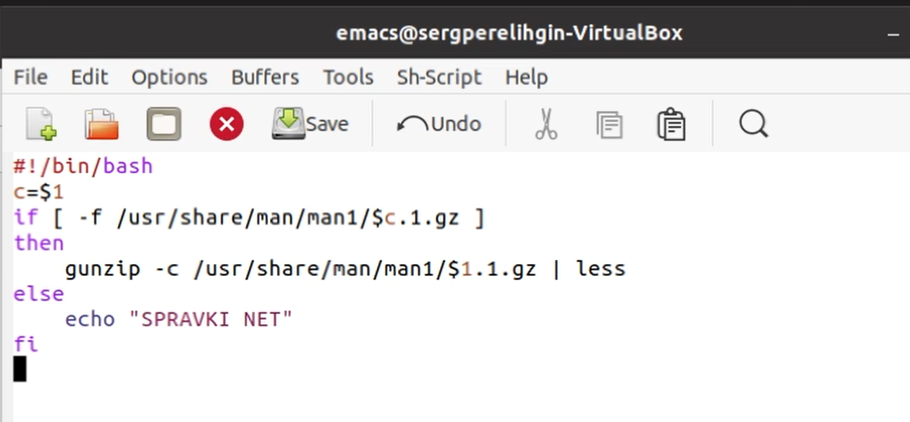{ #fig:010 width=70% }

Далее я проверил работу написанного скрипта (команды «./ex2.sh ls» и
«./ex2.sh mkdir»), предварительно добавив право на исполнение файла
(команда «chmod +x ex2.sh») (Рисунки 11, 12). Скрипт работает корректно.

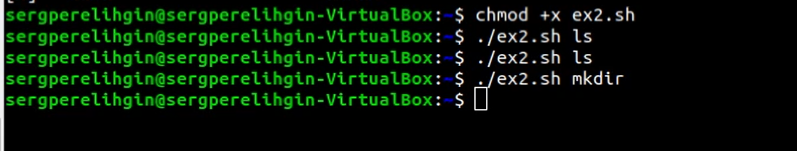{ #fig:011 width=70% }

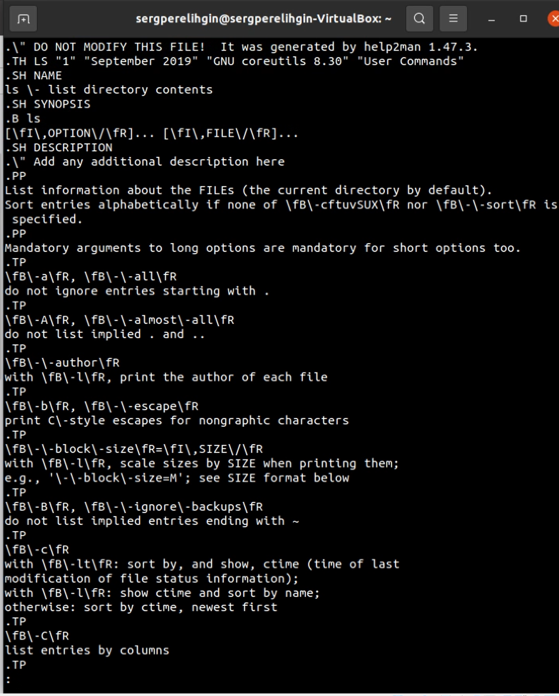{ #fig:012 width=70% }

3. Используя встроенную переменную $RANDOM, написал командный файл, генерирующий случайную последовательность букв латинского алфавита.
Для данной задачи я создал файл: ex3.sh (Рисунок 13) и написал
соответствующий скрипт.

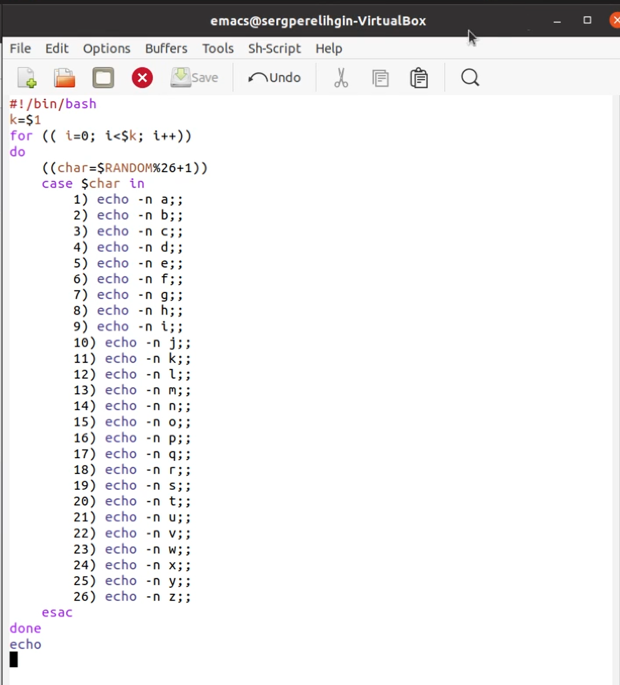{ #fig:013 width=70% }

Далее я проверил работу написанного скрипта, предварительно добавив право на исполнение файла (Рисунок 14). Скрипт работает корректно.

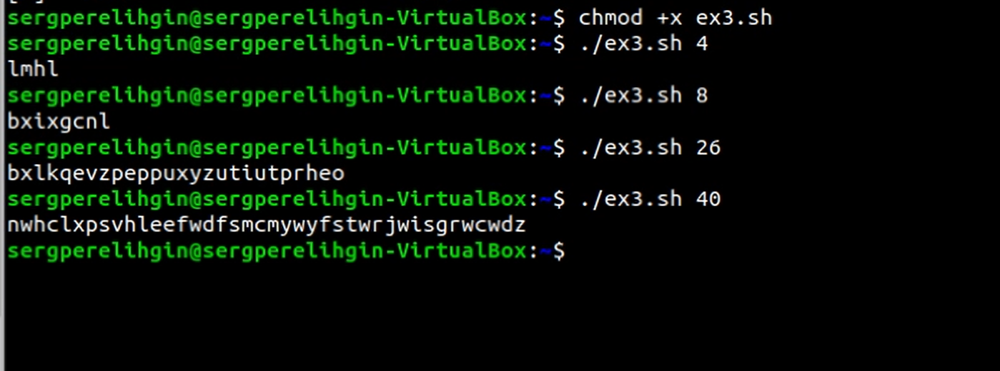{ #fig:014 width=70% }

# Ответы на контрольные вопросы

1) while [$1 != "exit"]

В данной строчке допущены следующие ошибки:

- не  хватает  пробелов  после  первой  скобки [и  перед  второй скобкой ]

- выражение $1 необходимо взять в “”, потому что эта переменная может содержать пробелы.

Таким образом, правильный вариант должен выглядеть так: while [“$1”!= "exit"]

2) Чтобы  объединить  несколько  строк  в  одну,  можно  воспользоваться несколькими способами:

- Первый:

VAR1="Hello,

"VAR2=" World"

VAR3="$VAR1$VAR2"

echo "$VAR3"

Результат: Hello, World

- Второй:

VAR1="Hello, "

VAR1+=" World"

echo "$VAR1"

Результат: Hello, World

3) Команда seq в Linux используется   для   генерации   чисел от ПЕРВОГО до ПОСЛЕДНЕГО шага INCREMENT.

Параметры:

- seq LAST: если задан только один аргумент, он создает числа от 1 до LAST с шагом шага, равным 1. Если LAST меньше 1, значение is не выдает.

- seq FIRST LAST: когда заданы два аргумента, он генерирует числа от FIRST до LAST с шагом 1, равным 1. Если LAST меньше FIRST, он не выдает никаких выходных данных.

- seq FIRST INCREMENT LAST: когда заданы три аргумента, он генерирует числа от FIRST до LAST на шаге INCREMENT . Если LAST меньше, чем FIRST, он не производит вывод.

- seq -f  «FORMAT»  FIRST  INCREMENT  LAST:  эта  команда используется    для    генерации    последовательности    в форматированном  виде. FIRST и INCREMENT являются необязательными.

- seq -s  «STRING» ПЕРВЫЙ  ВКЛЮЧЕНО:  Эта  команда используется для STRING для разделения чисел. По умолчанию это  значение  равно /n.  FIRST и INCREMENT являются необязательными.

- seq -w FIRST INCREMENT LAST:эта команда используется для выравнивания  ширины  путем  заполнения  начальными  нулями. FIRST и INCREMENT являются необязательными.

4) Результатом  данного  выражения $((10/3))будет  3,  потому  что это целочисленное деление без остатка.

5) Отличия командной оболочки zshот bash:

- В zsh более быстрое автодополнение для cdс помощью Тab

- В zsh существует  калькулятор zcalc,  способный  выполнять вычисления внутри терминала

- В zsh поддерживаются числа с плавающей запятой

- В zsh поддерживаются структуры данных «хэш»

- В zsh поддерживается раскрытие  полного  пути  на  основе 
неполных данных

- В zsh поддерживаетсязаменачастипути

- В zsh есть возможность отображать разделенный экран, такой же как разделенный экран vim

6) for((a=1; a<= LIMIT; a++))  синтаксис  данной  конструкции  верен, потому  что,  используя  двойные  круглые  скобки,  можно  не  писать $ перед переменными ().

7)Преимущества скриптового языка bash:

- Один  из  самых  распространенных  и  ставится  по  умолчаниюв большинстве дистрибутивах Linux, MacOS

- Удобное перенаправление ввода/вывода

- Большое количество команд для работы с файловыми системами Linux

- Можно писать собственные скрипты, упрощающие работу в Linux

Недостатки скриптового языка bash:

- Дополнительные   библиотеки   других   языков   позволяют выполнить больше действий

- Bash не является языков общего назначения

- Утилиты,  при  выполнении  скрипта,  запускают  свои  процессы, которые, в свою очередь, отражаются на быстроте выполнения этого скрипта

- Скрипты,  написанные  на bash,  нельзя  запустить  на  других операционных системах без дополнительных действий.

# Выводы

В ходе выполнения данной лабораторной работы я изучил основы
программирования в оболочке ОС UNIX, а также научился писать более
сложные командные файлы с использованием логических управляющих
конструкций и циклов.

# Библиография

* Кулябов Д.С. Операционные системы: лабораторные работы: учебное пособие / Д.С. Кулябов, М.Н. Геворкян, А.В. Королькова, А.В. Демидова. — М. : Изд-во РУДН, 2016. — 117 с. — ISBN 978-5-209-07626-1 : 139.13; То же [Электронный ресурс]. — URL: http://lib.rudn.ru/MegaPro2/Download/MObject/6118.
* Робачевский А.М. Операционная система UNIХ [текст] : Учебное пособие / А.М. Робачевский, С.А. Немнюгин, О.Л. Стесик. — 2-е изд., перераб. и доп. — СПб. : БХВ-Петербург, 2005, 2010. — 656 с. : ил. — ISBN 5-94157-538-6 : 164.56. (ЕТ 60)
* Таненбаум Эндрю. Современные операционные системы [Текст] / Э. Таненбаум. — 2-е изд. — СПб. : Питер, 2006. — 1038 с. : ил. — (Классика Computer Science). — ISBN 5-318-00299-4 : 446.05. (ЕТ 50)
* Ван Стеен М., Эндрю Таненбаум Распределенные системы. Принципы и парадигмы [Текст] / Э. Таненбаум, в.М. Стеен. — СПб. : Питер, 2003. — 877 с. : ил. — (Классика Computer science). — ISBN 5-272-00053-6 : 377.52. (ЕТ 50)
* Сафонов, В.О. Основы современных операционных систем : учебное пособие / В.О. Сафонов. — Москва : Интернет-Университет Информационных Технологий, 2011. — 584 с. — (Основы информационных технологий). — ISBN 978-5-9963-0495-0 ; То же [Электронный ресурс]. — URL: http://biblioclub.ru/index.php?page=book&id=233210.
* Немет Эви. UNIX — руководство системного администратора [Текст] / Э. Немет, Г. Снайдер, С. Сибасс; Э.Немет, Г.Снайдер, С.Сибасс, Х.Р.Трент. — 3-е изд. — СПб. : Питер, 2004. — 925 с. : ил. — (Для профессионалов). — ISBN 0-13-020601-6. — ISBN 5-318-00754-6 : 280.00. (ЕТ 30)
* Бек Л. Введение в системное программирование [Текст] / Л. Бек; Пер. с англ. Н.А.Богомолова, В.М.Вязовского и С.Е.Морковина; Под ред. Л.Н.Королева. — М. : Мир, 1988. — 448 с. : ил. — ISBN 5-03-000011-9 : 2.60. (ЕТ 3)
* Дьяконов Владимир Юрьевич. Системное программирование [Текст] : Учебное пособие для втузов / В.Ю. Дьяконов, В.А. Китов, И.А. Калинчев; Под ред. А.Л.Горелика. — М. : Высшая школа, 1990. — 221 с. : ил. — ISBN 5-06-000732-4 : 0.55.

