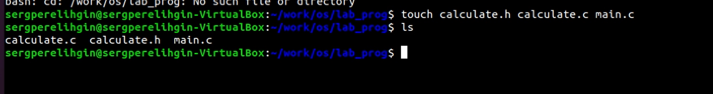
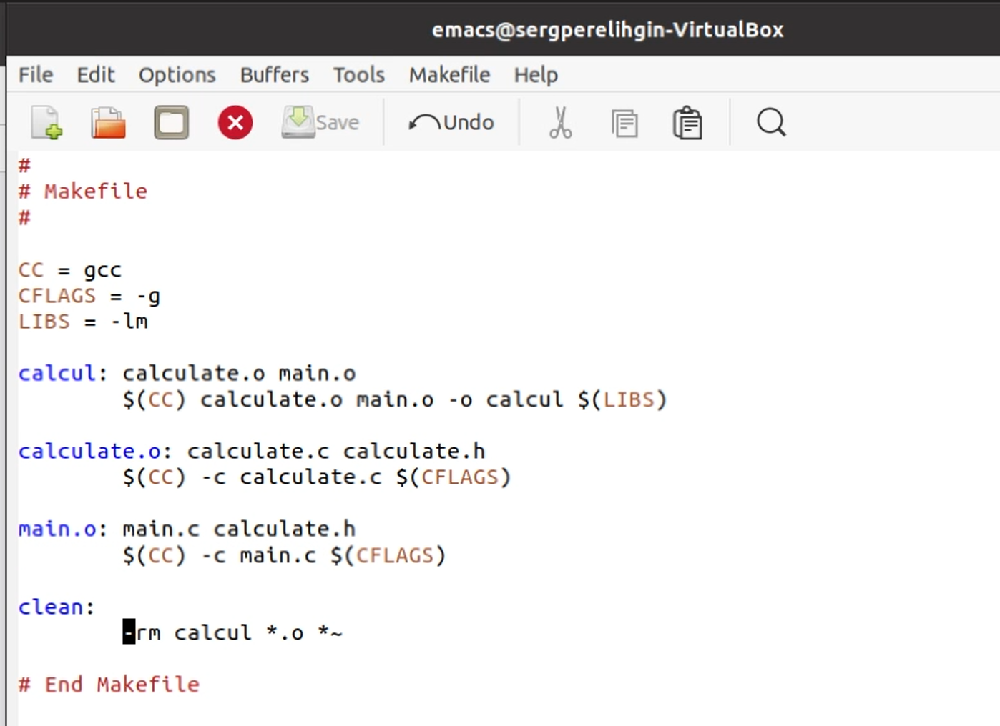
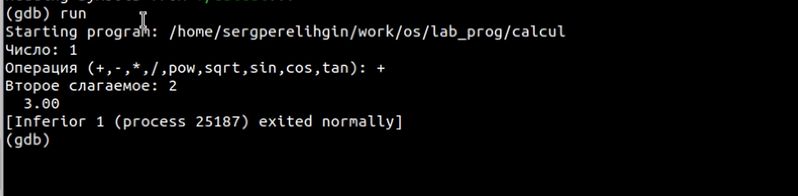
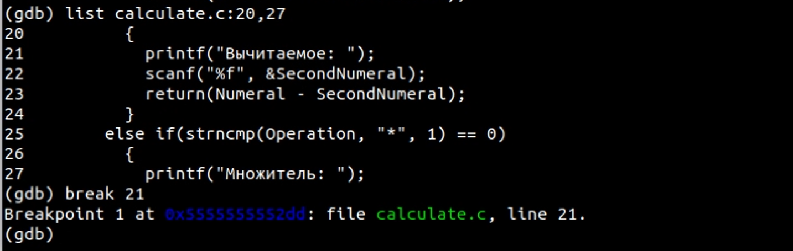
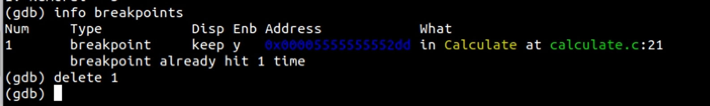
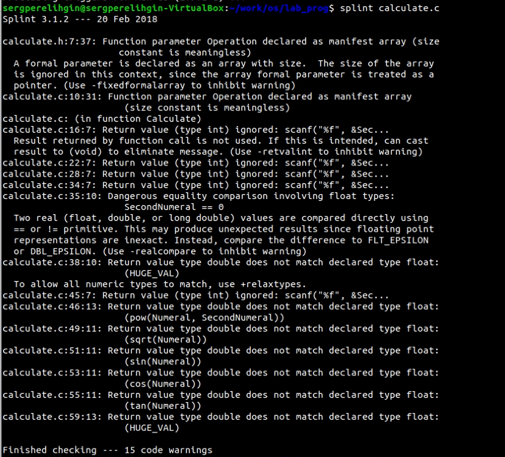
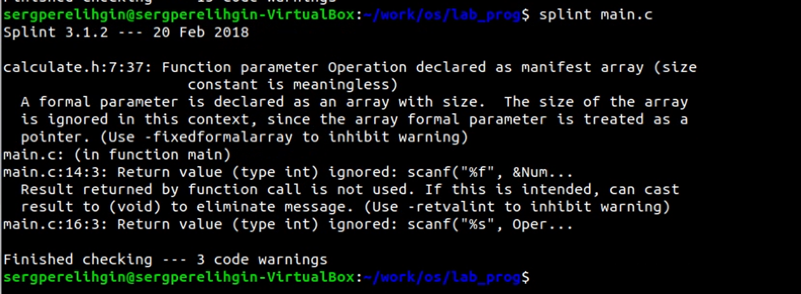

---
## Front matter
lang: ru-RU
title: Отчет по лабораторной работе №14
author: Перелыгин Сергей Викторович

## Formatting
mainfont: PT Serif
romanfont: PT Serif
sansfont: PT Sans
monofont: PT Mono
toc: false
slide_level: 2
theme: metropolis
aspectratio: 43
section-titles: true
---

# Цель работы

## Цель лабораторной работы

Приобрести простейшие навыки разработки, анализа, тестирования и отладки приложений в ОС типа UNIX/Linux на примере создания на языке  программирования С калькулятора с простейшими функциями.

# Выполнение лабораторной работы

## Выполнение лабораторной работы

В ходе выполнения ЛР я создал примитивный калькулятор, способный складывать, вычитать, умножать и делить, возводить число в степень, брать квадратный корень, вычислять sin, cos, tan. Для этого понадобилось заранее создать три файла (calculate.h, calculate.c, main.c)

{ #fig:001 width=70% }

## Выполнение лабораторной работы

Затем я скомпиллировал программу с помощью gcc. После этого я создал Makefile и при помощи отладчика GDB выполнил отладку программы.

{ #fig:002 width=70% }

---

{ #fig:003 width=70% }

## Выполнение лабораторной работы

Также я научился устанавливать точки останова и удалять их.

{ #fig:004 width=70% }

---

{ #fig:005 width=70% }

## Выполнение лабораторной работы

С помощью утилиты splint проанализировал коды файлов calculate.c и main.c., предварительно установив данную утилиту с помощью команд «sudo apt update» и «sudo apt install splint».

{ #fig:022 width=50% }

---

{ #fig:023 width=70% }

# Выводы

## Выводы

В ходе выполнения данной лабораторной работы я приобрел простейшие навыки разработки, анализа, тестирования и отладки приложений в ОС типа UNIX/Linux на примере создания на языке программирования С калькулятора с простейшими функциями.

---
Спасибо за внимание!
