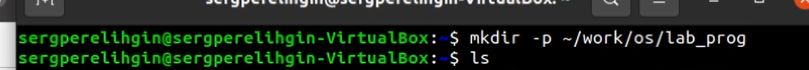

---
# Front matter
lang: ru-RU
title: "Отчёт по лабораторной работе № 14"
author: "Перелыгин Сергей Викторович"

# Formatting
toc-title: "Содержание"
toc: true # Table of contents
toc_depth: 2
lof: true # List of figures
fontsize: 12pt
linestretch: 1.5
papersize: a4paper
documentclass: scrreprt
polyglossia-lang: russian
polyglossia-otherlangs: english
mainfont: PT Serif
romanfont: PT Serif
sansfont: PT Sans
monofont: PT Mono
mainfontoptions: Ligatures=TeX
romanfontoptions: Ligatures=TeX
sansfontoptions: Ligatures=TeX,Scale=MatchLowercase
monofontoptions: Scale=MatchLowercase
indent: true
pdf-engine: lualatex
header-includes:
  - \linepenalty=10 # the penalty added to the badness of each line within a paragraph (no associated penalty node) Increasing the value makes tex try to have fewer lines in the paragraph.
  - \interlinepenalty=0 # value of the penalty (node) added after each line of a paragraph.
  - \hyphenpenalty=50 # the penalty for line breaking at an automatically inserted hyphen
  - \exhyphenpenalty=50 # the penalty for line breaking at an explicit hyphen
  - \binoppenalty=700 # the penalty for breaking a line at a binary operator
  - \relpenalty=500 # the penalty for breaking a line at a relation
  - \clubpenalty=150 # extra penalty for breaking after first line of a paragraph
  - \widowpenalty=150 # extra penalty for breaking before last line of a paragraph
  - \displaywidowpenalty=50 # extra penalty for breaking before last line before a display math
  - \brokenpenalty=100 # extra penalty for page breaking after a hyphenated line
  - \predisplaypenalty=10000 # penalty for breaking before a display
  - \postdisplaypenalty=0 # penalty for breaking after a display
  - \floatingpenalty = 20000 # penalty for splitting an insertion (can only be split footnote in standard LaTeX)
  - \raggedbottom # or \flushbottom
  - \usepackage{float} # keep figures where there are in the text
  - \floatplacement{figure}{H} # keep figures where there are in the text
---

# Цель работы

Приобрести простейшие навыки разработки, анализа, тестирования и отладки приложений в ОС типа UNIX/Linux на примере создания на языке  программирования С калькулятора с простейшими функциями.

# Выполнение лабораторной работы

1. В домашнем каталоге создаю подкаталог ~/work/os/lab_prog с
помощью команды «mkdir -p ~/work/os/lab_prog» (Рисунок 1).

{ #fig:001 width=70% }

2. Создал в каталоге файлы: calculate.h, calculate.c, main.c, используя
команды «cd ~/work/os/lab_prog» и «touch calculate.h calculate.c
main.c» (Рисунок 2)

{ #fig:001 width=70% }

Это будет примитивнейший калькулятор, способный складывать, вычитать, умножать и делить, возводить число в степень, брать квадратный корень, вычислять sin, cos, tan. При запуске он будет запрашивать первое число, операцию, второе число. После этого программа выведет результат и остановится. Открыв редактор Emacs, приступил к редактированию созданных
файлов. Реализация функций калькулятора в файле calculate.с (Рисунки 3, 4).

{ #fig:001 width=70% }

{ #fig:001 width=70% }

Интерфейсный файл calculate.h, описывающий формат вызова функции калькулятора (Рисунок 5).

{ #fig:001 width=70% }

Основной файл main.c, реализующий интерфейс пользователя к
калькулятору (Рисунок 6).

{ #fig:001 width=70% }

3. Выполнил компиляцию программы посредством gcc (версия компилятора: 8.3.0-19), используя команды «gcc -c calculate.c», «gcc -c main.c» и «gcc calculate.o main.o -o calcul -lm» (Рисунок 7).

{ #fig:001 width=70% }

4. В ходе компиляции программы никаких ошибок выявлено не было.
5. Создал Makefile с необходимым содержанием (Рисунок 8).

{ #fig:001 width=70% }

Данный файл необходим для автоматической компиляции файлов calculate.c (цель calculate.o), main.c (цель main.o), а также их объединения в один исполняемый файл calcul (цель calcul). Цель clean нужна для автоматического удаления файлов. Переменная CC отвечает за утилиту для компиляции. Переменная CFLAGS отвечает за опции в данной утилите. Переменная LIBS отвечает за опции для объединения объектных файлов в один исполняемый файл.

6. Далее исправила Makefile (Рисунок 9).

{ #fig:001 width=70% }

В переменную CFLAGS добавил опцию -g, необходимую для компиляции объектных файлов и их использования в программе отладчика GDB. Сделал так, что утилита компиляции выбирается с помощью переменной CC. После этого я удалил исполняемые и объектные файлы из каталога с помощью команды «make clear» (Рисунок 10). Выполнил компиляцию файлов, используя команды «make calculate.o», «make main.o», «male calcul» (Рисунок 11).

{ #fig:001 width=70% }

{ #fig:001 width=70% }

Далее с помощью gdb выполнил отладку программы calcul. Запустил отладчик GDB, загрузив в него программу для отладки, используя команду: «gdb ./calcul» (Рисунок 12).

{ #fig:001 width=70% }

Для запуска программы внутри отладчика ввела команду «run»
(Рисунок 13).

{ #fig:001 width=70% }

Для постраничного (по 10 строк) просмотра исходного кода использовал команду «list» (Рисунок 14).

{ #fig:001 width=70% }

Для просмотра строк с 12 по 15 основного файла использовал команду «list 12,15» (Рисунок 15).

{ #fig:001 width=70% }

Для просмотра определённых строк не основного файла использовал команду «list calculate.c:20,29» (Рисунок 16).

{ #fig:001 width=70% }

Установил точку останова в файле calculate.c на строке номер 21, используя команды «list calculate.c:20,27» и «break 21» (Рисунок 17).

{ #fig:001 width=70% }

Вывел информацию об имеющихся в проекте точках останова с помощью команды «info breakpoints» (Рисунок 18).

{ #fig:001 width=70% }

Запустил программу внутри отладчика и убедилась, что программа
остановилась в момент прохождения точки останова. Использовал команды «run», «5», «−» и «backtrace» (Рисунок 19).

{ #fig:001 width=70% }

Посмотрел, чему равно на этом этапе значение переменной Numeral, введя команду «print Numeral» (Рисунок 20).

{ #fig:001 width=70% }

Сравнил с результатом вывода на экран после использования команды «display Numeral». Значения совпадают (Рисунок 21).

{ #fig:001 width=70% }

Убрал точки останова с помощью команд «info breakpoints» и «delete 1» (Рисунок 22).

{ #fig:001 width=70% }

7. С помощью утилиты splint проанализировал коды файлов calculate.c
и main.c. Предварительно я установил данную утилиту с помощью
команд «sudo apt update» и «sudo apt install splint» (Рисунок 23).

{ #fig:001 width=70% }

Далее воспользовался командами «splint calculate.c» и «splint
main.c» (Рисунки 24, 25). C помощью утилиты splint выяснилось, что в файлах calculate.c и main.c присутствует функция чтения scanf, возвращающая целое число (тип int), но эти числа не используются и нигде не сохранятся. Утилита вывела предупреждение о том, что в файле calculate.c происходит сравнение вещественного числа с нулем. Также
возвращаемые значения (тип double) в функциях pow, sqrt, sin, cos и
tan записываются в переменную типа float, что свидетельствует о
потери данных.

{ #fig:001 width=70% }

{ #fig:001 width=70% }

# Ответы на контрольные вопросы

1) Чтобы получить информацию о возможностях программ gcc, make, gdb и др. нужно воспользоваться командой man или опцией -help (-h) для каждой команды.

2) Процесс разработки программного обеспечения обычно разделяется на следующие этапы: 

- планирование,  включающее  сбор  и  анализ  требований  к функционалу  и  другим  характеристикам  разрабатываемого приложения; 

- проектирование,  включающее  в  себя  разработку  базовых алгоритмов    и    спецификаций, определение  языка программирования; 

- непосредственная разработка приложения: 

1. кодирование − по  сути  создание  исходного  текста программы (возможно в нескольких вариантах); –анализ разработанного кода; 

2. сборка, компиляция и разработка исполняемого модуля; 

3. тестирование  и  отладка,  сохранение  произведённых изменений; 

- документирование.

Для  создания  исходного  текста  программы  разработчик  может воспользоваться любым удобным для него редактором текста: vi, vim, mceditor, emacs, geanyи др.

После  завершения  написания  исходного  кода  программы  (возможно состоящей из нескольких файлов), необходимо её скомпилировать и получить исполняемый модуль.

3) Для имени  входного  файла  суффикс  определяет  какая  компиляция требуется. Суффиксы указывают на тип объекта. Файлы с расширением (суффиксом) .c воспринимаются gcc как программы на языке С, файлы с  расширением  .cc или  .C − как  файлы  на  языке C++,  а  файлы c расширением .o считаются объектными. Например, в команде «gcc-c main.c»: gcc по расширению (суффиксу) .c распознает тип файла для компиляции и формирует объектный модуль − файл с расширением .o. Если требуется получить исполняемый файл с определённым именем (например, hello), то требуется воспользоваться опцией -o и в качестве параметра задать имя создаваемого файла: «gcc -o hello main.c».

4) Основное  назначение  компилятора языка  Си  в UNIX заключается  в компиляции всей программы и получении исполняемого файла/модуля.

5) Для сборки разрабатываемого приложения и собственно компиляции полезно   воспользоваться   утилитой make.   Она   позволяет автоматизировать процесс преобразования файлов программы из одной формы в другую, отслеживает взаимосвязи между файлами.

6) Для работы с утилитой make необходимо в корне рабочего каталога с Вашим проектом создать файл с названием makefile или Makefile, в котором  будут  описаны  правила  обработки  файлов  Вашего программного комплекса.

В самом простом случае Makefile имеет следующий синтаксис:

<цель_1> <цель_2> ... : <зависимость_1> <зависимость_2> ...<команда 1>

...

<команда n>

Сначала задаётся список целей, разделённых пробелами, за которым идёт двоеточие и список зависимостей. Затем в следующих строках указываются  команды.  Строки  с  командами  обязательно  должны начинаться с табуляции. 

В качестве цели в Makefile может выступать имя файла или название какого-то действия. Зависимость задаёт исходные параметры (условия) для  достижения  указанной  цели.  Зависимость  также  может  быть названием  какого-то  действия.  Команды  −  собственно  действия, которые необходимо выполнить для достижения цели.

Общий синтаксис Makefileимеет вид: 

target1 [target2...]:[:] [dependment1...]

[(tab)commands] [#commentary]

[(tab)commands] [#commentary]

Здесь знак # определяет начало комментария (содержимое от знака # и до  конца  строки  не  будет  обрабатываться.  Одинарное  двоеточие указывает на то, что последовательность команд должна содержаться в одной строке. Для переноса можно в длинной строке команд можно использовать обратный слэш (\). Двойное двоеточие указывает на то, что  последовательность  команд  может  содержаться  в  нескольких последовательных строках.

Пример более сложного синтаксиса Makefile:

 #

 # Makefile for abcd.c

 #

CC = gcc

CFLAGS =

 # Compile abcd.c normaly

abcd: abcd.c

	$(CC) -o abcd $(CFLAGS) abcd.c
	
clean:

	-rm abcd *.o *~
	
	
 # End Make file for abcd.c 

В этом примере в начале файла заданы три переменные: CC и CFLAGS. Затем указаны цели, их зависимости и соответствующие команды. В командах  происходит  обращение  к  значениям  переменных.  Цель  с именем cleanпроизводит очистку каталога от файлов, полученных в результате  компиляции. Для  её  описания  использованы  регулярные выражения.

7) Во  время  работы  над  кодом  программы  программист  неизбежно сталкивается с появлением ошибок в ней. Использование отладчика для поиска и устранения ошибок в программе существенно облегчает жизнь программиста. В комплект программ GNU для ОС типа UNIX входит отладчик GDB (GNUDebugger). 

Для использования GDB необходимо скомпилировать анализируемый код  программы  таким  образом,  чтобы  отладочная  информация содержалась  в  результирующем  бинарном  файле.  Для  этого  следует воспользоваться опцией -gкомпилятора gcc:

gcc -c file.c -g

После этого для начала работы с gdb необходимо в командной строке ввести  одноимённую  команду,  указав  в  качестве  аргумента анализируемый бинарный файл:

gdb file.o

8) Основные команды отладчика gdb:

- backtrace − вывод на экран пути к текущей точке останова (по сути вывод − названий всех функций)

- break − установить точку останова (в качестве параметра может быть указан номер строки или название функции)

- clear − удалить все точки останова в функции

- continue − продолжить выполнение программы

- delete − удалить точку останова

- display − добавить  выражение  в  список  выражений,  значения которых  отображаются  при  достижении  точки  останова программы

- finish − выполнить программу до момента выхода из функции

- info breakpoints − вывести на экран список используемых точек останова

- info  watchpoints − вывести  на  экран  список  используемых контрольных выражений

- list − вывести на экран исходный код (в качестве параметра может быть указано название файла и через двоеточие номера начальнойи конечной строк)

- next − выполнить  программу  пошагово,  но  без  выполнения вызываемых в программе функций

- print − вывести  значение  указываемого  в  качестве  параметра выражения

- run − запуск программы на выполнение

- set − установить новое значение переменной

- step − пошаговое выполнение программы

- watch − установить  контрольное  выражение,  при  изменении значения которого программа будет остановлена

Для выхода из gdb можно воспользоваться командой quit (или её сокращённым  вариантом q)  или  комбинацией  клавиш Ctrl-d. Более подробную информацию по работе с gdb можно получить с помощью команд gdb -h и man gdb.

9) Cхема отладки программы показана в 6 пункте лабораторной работы.

10) При запуске компилятор выдал ошибку в строке:

scanf(“%s”, &Operation);

нужно убрать знак &, потому что имя массива символов уже является указателем на первый элемент этого массива.

11) Система  разработки приложений UNIX предоставляет  различные средства, повышающие понимание исходного кода. К ним относятся:

- cscope − исследование функций, содержащихся в программе,

- lint − критическая проверка программ, написанных на языке Си.

12) Утилита splint анализирует  программный  код,  проверяет корректность  задания  аргументов  использованных  в  программе функций   и   типов   возвращаемых   значений,   обнаруживает синтаксические и семантические ошибки.

В отличие от компилятора C анализатор splint генерирует комментарии с описанием разбора кода программы и осуществляет общий контроль, обнаруживая такие ошибки, как одинаковые объекты, определённые в разных файлах, или объекты, чьи значения не используются в работе программы,  переменные  с  некорректно  заданными  значениямии типами и многое другое.

# Выводы

В ходе выполнения данной лабораторной работы я приобрел простейшие навыки разработки, анализа, тестирования и отладки приложений в ОС типа UNIX/Linux на примере создания на языке программирования С калькулятора с простейшими функциями.

# Библиография

* Кулябов Д.С. Операционные системы: лабораторные работы: учебное пособие / Д.С. Кулябов, М.Н. Геворкян, А.В. Королькова, А.В. Демидова. — М. : Изд-во РУДН, 2016. — 117 с. — ISBN 978-5-209-07626-1 : 139.13; То же [Электронный ресурс]. — URL: http://lib.rudn.ru/MegaPro2/Download/MObject/6118.
* Робачевский А.М. Операционная система UNIХ [текст] : Учебное пособие / А.М. Робачевский, С.А. Немнюгин, О.Л. Стесик. — 2-е изд., перераб. и доп. — СПб. : БХВ-Петербург, 2005, 2010. — 656 с. : ил. — ISBN 5-94157-538-6 : 164.56. (ЕТ 60)
* Таненбаум Эндрю. Современные операционные системы [Текст] / Э. Таненбаум. — 2-е изд. — СПб. : Питер, 2006. — 1038 с. : ил. — (Классика Computer Science). — ISBN 5-318-00299-4 : 446.05. (ЕТ 50)
* Ван Стеен М., Эндрю Таненбаум Распределенные системы. Принципы и парадигмы [Текст] / Э. Таненбаум, в.М. Стеен. — СПб. : Питер, 2003. — 877 с. : ил. — (Классика Computer science). — ISBN 5-272-00053-6 : 377.52. (ЕТ 50)
* Сафонов, В.О. Основы современных операционных систем : учебное пособие / В.О. Сафонов. — Москва : Интернет-Университет Информационных Технологий, 2011. — 584 с. — (Основы информационных технологий). — ISBN 978-5-9963-0495-0 ; То же [Электронный ресурс]. — URL: http://biblioclub.ru/index.php?page=book&id=233210.
* Немет Эви. UNIX — руководство системного администратора [Текст] / Э. Немет, Г. Снайдер, С. Сибасс; Э.Немет, Г.Снайдер, С.Сибасс, Х.Р.Трент. — 3-е изд. — СПб. : Питер, 2004. — 925 с. : ил. — (Для профессионалов). — ISBN 0-13-020601-6. — ISBN 5-318-00754-6 : 280.00. (ЕТ 30)
* Бек Л. Введение в системное программирование [Текст] / Л. Бек; Пер. с англ. Н.А.Богомолова, В.М.Вязовского и С.Е.Морковина; Под ред. Л.Н.Королева. — М. : Мир, 1988. — 448 с. : ил. — ISBN 5-03-000011-9 : 2.60. (ЕТ 3)
* Дьяконов Владимир Юрьевич. Системное программирование [Текст] : Учебное пособие для втузов / В.Ю. Дьяконов, В.А. Китов, И.А. Калинчев; Под ред. А.Л.Горелика. — М. : Высшая школа, 1990. — 221 с. : ил. — ISBN 5-06-000732-4 : 0.55.

