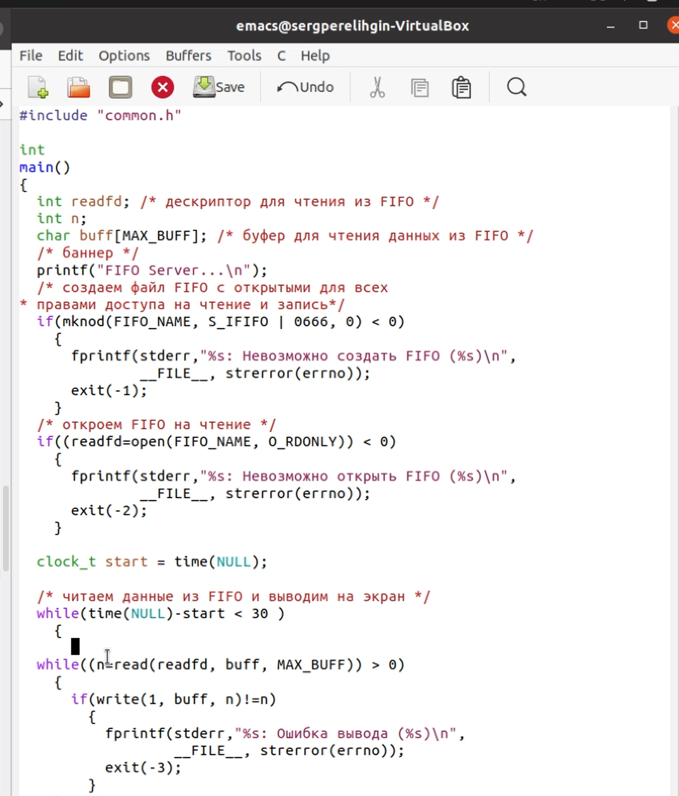

---
## Front matter
lang: ru-RU
title: Отчет по лабораторной работе №15
author: Перелыгин Сергей Викторович

## Formatting
mainfont: PT Serif
romanfont: PT Serif
sansfont: PT Sans
monofont: PT Mono
toc: false
slide_level: 2
theme: metropolis
aspectratio: 43
section-titles: true
---

# Цель работы

## Цель лабораторной работы

Приобретение   практических   навыков   работы   с именованными каналами.

# Выполнение лабораторной работы

## Выполнение лабораторной работы

Сначала я создал необходимые для работы файлы common.h, server.c, client.c и Makefile (рис.1). 

{ #fig:001 width=70% }

## Выполнение лабораторной работы

Далее в файл common.h я добавил стандартные заголовочные файлы unistd.h и time.h, необходимые  для  работы  кодов  других  файлов.(рис.2). 

{ #fig:001 width=50% }

## Выполнение лабораторной работы

В файл server.c добавил цикл while для контроля за временем работы сервера. Разница между текущим временем time(NULL) и временем начала работы clock_tstart=time(NULL) не должна превышать 30 секунд (рис.3). 

{ #fig:003 width=37% }

## Выполнение лабораторной работы

В файл client.c добавил цикл, который отвечает за количество сообщений о текущем времени и команду sleep(5) для приостановки работы клиента на 5 секунд (рис.4). 

{ #fig:004 width=37% }

## Выполнение лабораторной работы

Далее написал Makefile (рис.5). 

{ #fig:005 width=50% }

## Выполнение лабораторной работы

Отрыл  3  консоли и  запустил:  в  первом  терминале −«./server», в остальных двух – «./client». Спустя 30 секунд работа сервера была прекращена (рис.6). 

{ #fig:006 width=70% }

# Выводы

## Выводы

В  ходе  выполнения  данной  лабораторной  работы  я  приобрел практические навыки работы с именованными каналами.

---
Спасибо за внимание!
