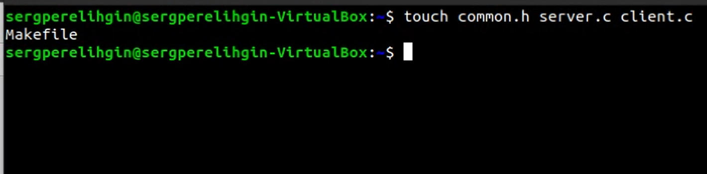

---
# Front matter
lang: ru-RU
title: "Отчёт по лабораторной работе № 15"
author: "Перелыгин Сергей Викторович"

# Formatting
toc-title: "Содержание"
toc: true # Table of contents
toc_depth: 2
lof: true # List of figures
fontsize: 12pt
linestretch: 1.5
papersize: a4paper
documentclass: scrreprt
polyglossia-lang: russian
polyglossia-otherlangs: english
mainfont: PT Serif
romanfont: PT Serif
sansfont: PT Sans
monofont: PT Mono
mainfontoptions: Ligatures=TeX
romanfontoptions: Ligatures=TeX
sansfontoptions: Ligatures=TeX,Scale=MatchLowercase
monofontoptions: Scale=MatchLowercase
indent: true
pdf-engine: lualatex
header-includes:
  - \linepenalty=10 # the penalty added to the badness of each line within a paragraph (no associated penalty node) Increasing the value makes tex try to have fewer lines in the paragraph.
  - \interlinepenalty=0 # value of the penalty (node) added after each line of a paragraph.
  - \hyphenpenalty=50 # the penalty for line breaking at an automatically inserted hyphen
  - \exhyphenpenalty=50 # the penalty for line breaking at an explicit hyphen
  - \binoppenalty=700 # the penalty for breaking a line at a binary operator
  - \relpenalty=500 # the penalty for breaking a line at a relation
  - \clubpenalty=150 # extra penalty for breaking after first line of a paragraph
  - \widowpenalty=150 # extra penalty for breaking before last line of a paragraph
  - \displaywidowpenalty=50 # extra penalty for breaking before last line before a display math
  - \brokenpenalty=100 # extra penalty for page breaking after a hyphenated line
  - \predisplaypenalty=10000 # penalty for breaking before a display
  - \postdisplaypenalty=0 # penalty for breaking after a display
  - \floatingpenalty = 20000 # penalty for splitting an insertion (can only be split footnote in standard LaTeX)
  - \raggedbottom # or \flushbottom
  - \usepackage{float} # keep figures where there are in the text
  - \floatplacement{figure}{H} # keep figures where there are in the text
---

# Цель работы

# Выполнение лабораторной работы

{ #fig:001 width=70% }

# Ответы на контрольные вопросы

# Выводы

# Библиография

* Кулябов Д.С. Операционные системы: лабораторные работы: учебное пособие / Д.С. Кулябов, М.Н. Геворкян, А.В. Королькова, А.В. Демидова. — М. : Изд-во РУДН, 2016. — 117 с. — ISBN 978-5-209-07626-1 : 139.13; То же [Электронный ресурс]. — URL: http://lib.rudn.ru/MegaPro2/Download/MObject/6118.
* Робачевский А.М. Операционная система UNIХ [текст] : Учебное пособие / А.М. Робачевский, С.А. Немнюгин, О.Л. Стесик. — 2-е изд., перераб. и доп. — СПб. : БХВ-Петербург, 2005, 2010. — 656 с. : ил. — ISBN 5-94157-538-6 : 164.56. (ЕТ 60)
* Таненбаум Эндрю. Современные операционные системы [Текст] / Э. Таненбаум. — 2-е изд. — СПб. : Питер, 2006. — 1038 с. : ил. — (Классика Computer Science). — ISBN 5-318-00299-4 : 446.05. (ЕТ 50)
* Ван Стеен М., Эндрю Таненбаум Распределенные системы. Принципы и парадигмы [Текст] / Э. Таненбаум, в.М. Стеен. — СПб. : Питер, 2003. — 877 с. : ил. — (Классика Computer science). — ISBN 5-272-00053-6 : 377.52. (ЕТ 50)
* Сафонов, В.О. Основы современных операционных систем : учебное пособие / В.О. Сафонов. — Москва : Интернет-Университет Информационных Технологий, 2011. — 584 с. — (Основы информационных технологий). — ISBN 978-5-9963-0495-0 ; То же [Электронный ресурс]. — URL: http://biblioclub.ru/index.php?page=book&id=233210.
* Немет Эви. UNIX — руководство системного администратора [Текст] / Э. Немет, Г. Снайдер, С. Сибасс; Э.Немет, Г.Снайдер, С.Сибасс, Х.Р.Трент. — 3-е изд. — СПб. : Питер, 2004. — 925 с. : ил. — (Для профессионалов). — ISBN 0-13-020601-6. — ISBN 5-318-00754-6 : 280.00. (ЕТ 30)
* Бек Л. Введение в системное программирование [Текст] / Л. Бек; Пер. с англ. Н.А.Богомолова, В.М.Вязовского и С.Е.Морковина; Под ред. Л.Н.Королева. — М. : Мир, 1988. — 448 с. : ил. — ISBN 5-03-000011-9 : 2.60. (ЕТ 3)
* Дьяконов Владимир Юрьевич. Системное программирование [Текст] : Учебное пособие для втузов / В.Ю. Дьяконов, В.А. Китов, И.А. Калинчев; Под ред. А.Л.Горелика. — М. : Высшая школа, 1990. — 221 с. : ил. — ISBN 5-06-000732-4 : 0.55.

