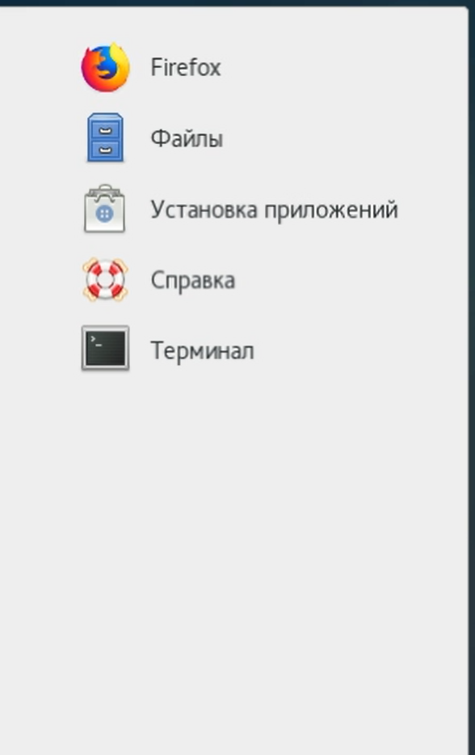

---
## Front matter
lang: ru-RU
title: Отчет по лабораторной работе №4
author: Перелыгин Сергей Викторович

## Formatting
mainfont: PT Serif
romanfont: PT Serif
sansfont: PT Sans
monofont: PT Mono
toc: false
slide_level: 2
theme: metropolis
aspectratio: 43
section-titles: true
---

# Цель работы

## Цель лабораторной работы

Познакомиться с операционной системой Linux, получить практические навыки работы с консолью и некоторыми графическими менеджерами рабочих столов операционной системы.

# Выполнение лабораторной работы

## Начало выполнения работы
- Ознакомился с текстовыми консолями, перемещаясь между ними с помощью комбинации клавишей Ctrl + Alt + Fn (F1, F2 . . . , F6).
- Затем зарегистрировался в текстовой консоли операционной
системы и завершил работу с помощью комбинации клавиш Ctrl+D.

{ #fig:001 width=70% }

## Ознакомление с различными графическими средами
Я ознакомился с менеджером рабочих столов и поочерёдно зарегистрировался в разных графических менеджерах рабочих столов на моём компьютере(GNOME, KDE, XFCE):

{ #fig:002 width=70% }

---

{ #fig:003 width=70% }

---

{ #fig:004 width=70% }

## Просмотр установленных программ

Также я изучил список установленных программ и обратил внимание на предпочтительные программы:

{ #fig:005 width=60% }

## Запуск некоторых программ

Затем я поочерёдно запустил браузер, текстовой редактор, текстовой процессор и эмулятор консоли.

{ #fig:006 width=70% }

---

{ #fig:07 width=70% }

---

{ #fig:08 width=70% }

---

{ #fig:09 width=70% }

---

# Выводы
## Вывод

в ходе выполнения данной лабораторной работы я познакомился с операционной системой Linux, получил практические навыки работы с консолью и некоторыми графическими менеджерами рабочих столов операционной системы.

---
Спасибо за внимание!
