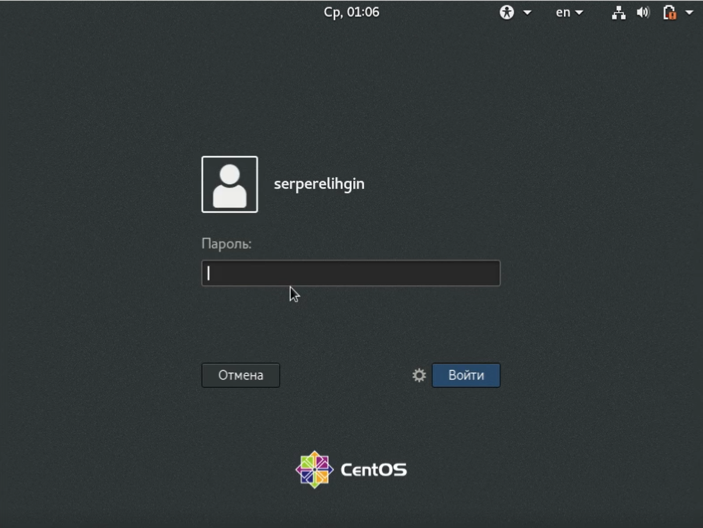
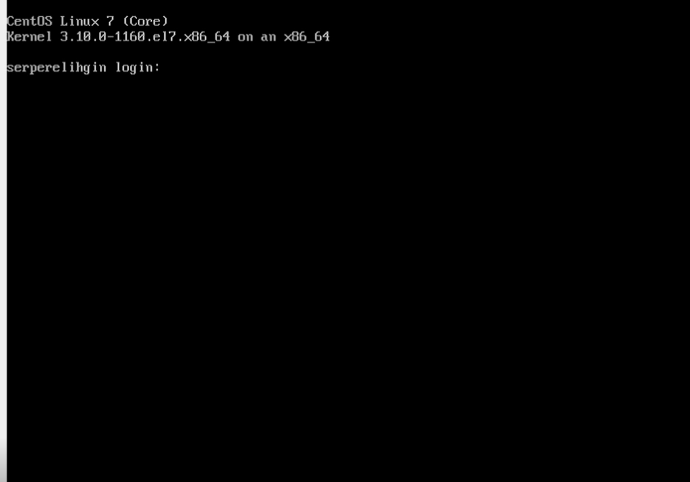
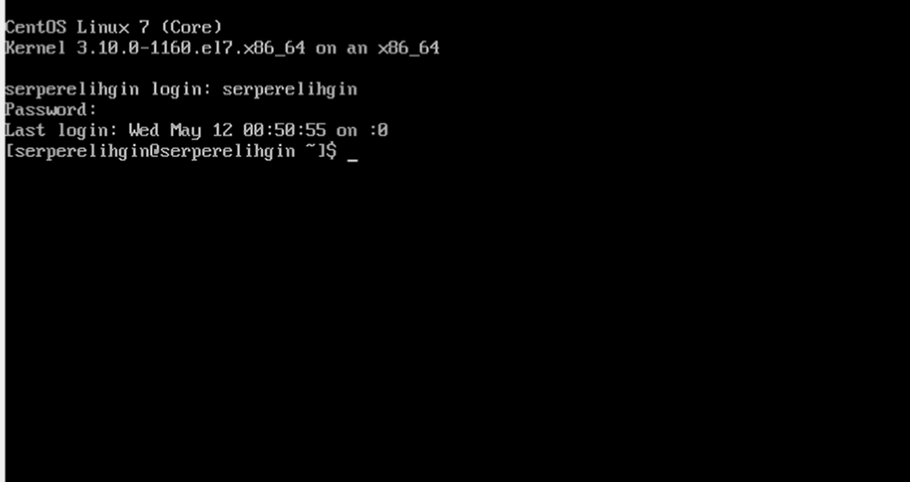
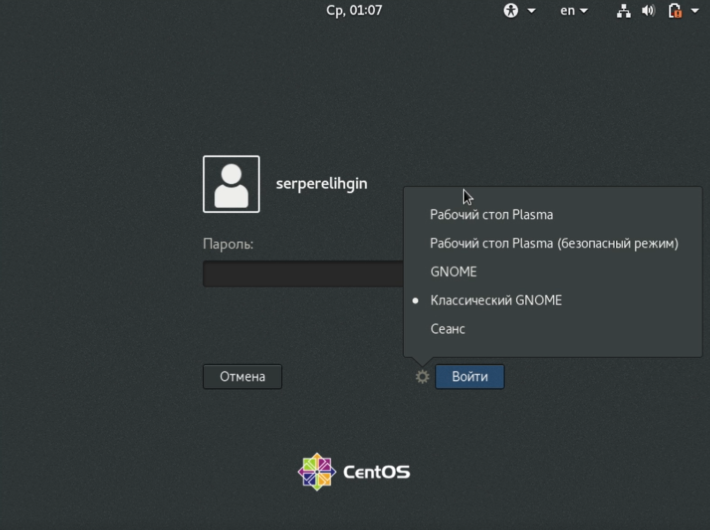
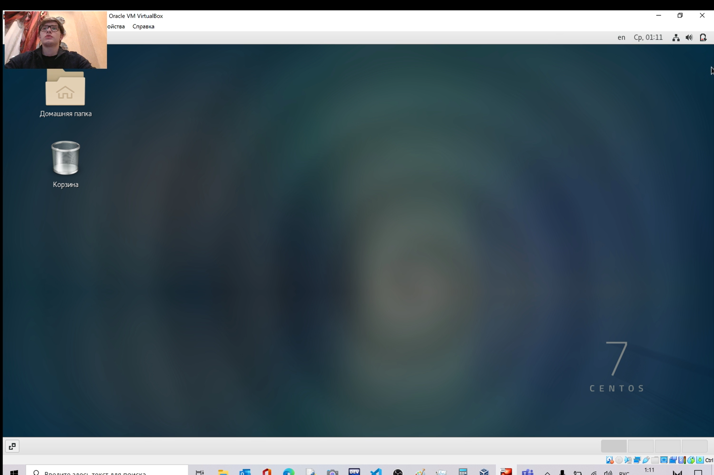
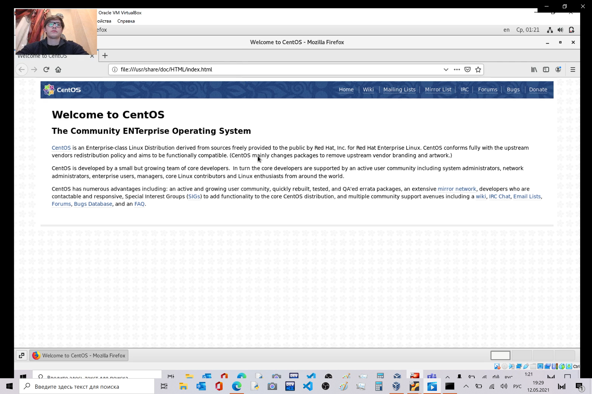
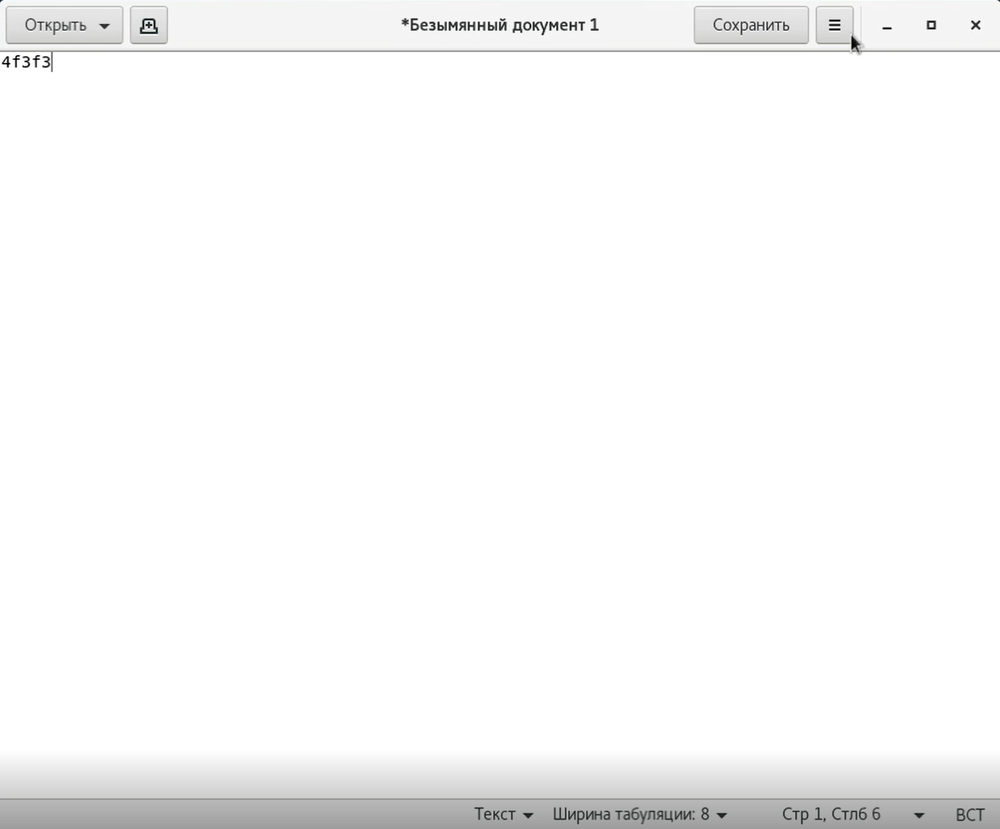
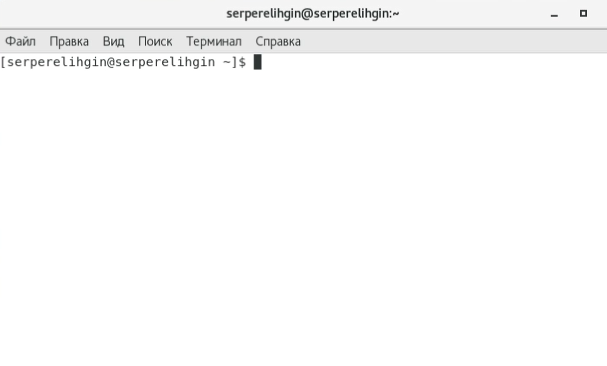

---
# Front matter
lang: ru-RU
title: "Отчёт по лабораторной работе № 4"
subtitle: "Дисциплина:	Операционные системы"
author: "Перелыгин Сергей Викторович"

# Formatting
toc-title: "Содержание"
toc: true # Table of contents
toc_depth: 2
lof: true # List of figures
fontsize: 12pt
linestretch: 1.5
papersize: a4paper
documentclass: scrreprt
polyglossia-lang: russian
polyglossia-otherlangs: english
mainfont: PT Serif
romanfont: PT Serif
sansfont: PT Sans
monofont: PT Mono
mainfontoptions: Ligatures=TeX
romanfontoptions: Ligatures=TeX
sansfontoptions: Ligatures=TeX,Scale=MatchLowercase
monofontoptions: Scale=MatchLowercase
indent: true
pdf-engine: lualatex
header-includes:
  - \linepenalty=10 # the penalty added to the badness of each line within a paragraph (no associated penalty node) Increasing the value makes tex try to have fewer lines in the paragraph.
  - \interlinepenalty=0 # value of the penalty (node) added after each line of a paragraph.
  - \hyphenpenalty=50 # the penalty for line breaking at an automatically inserted hyphen
  - \exhyphenpenalty=50 # the penalty for line breaking at an explicit hyphen
  - \binoppenalty=700 # the penalty for breaking a line at a binary operator
  - \relpenalty=500 # the penalty for breaking a line at a relation
  - \clubpenalty=150 # extra penalty for breaking after first line of a paragraph
  - \widowpenalty=150 # extra penalty for breaking before last line of a paragraph
  - \displaywidowpenalty=50 # extra penalty for breaking before last line before a display math
  - \brokenpenalty=100 # extra penalty for page breaking after a hyphenated line
  - \predisplaypenalty=10000 # penalty for breaking before a display
  - \postdisplaypenalty=0 # penalty for breaking after a display
  - \floatingpenalty = 20000 # penalty for splitting an insertion (can only be split footnote in standard LaTeX)
  - \raggedbottom # or \flushbottom
  - \usepackage{float} # keep figures where there are in the text
  - \floatplacement{figure}{H} # keep figures where there are in the text
---

# Цель работы

Познакомиться с операционной системой Linux, получить практические навыки работы с консолью и некоторыми графическими менеджерами рабочих  столов операционной системы.

# Задание

1. Ознакомиться с теоретическим материалом.
2. Перемещаться между текстовыми консолями.
5. Зарегистрироваться в текстовой консоли операционной системы. 
8. Ознакомиться с менеджером рабочих столов. 
9. Поочерёдно зарегистрироваться в разных графических менеджерах рабочих столов(GNOME,KDE,XFCE) и оконных менеджерах (Openbox).Продемонстрировать разницумежду ними, сделав снимки экрана (скриншоты).
10. Изучить список установленных программ.

# Выполнение лабораторной работы

1. Сначала я ознакомился с теоретическим материалом, загрузил компьютер и приступил к выполнению лабораторной работы.

{ #fig:001 width=70% }

2. Переходим на текстовую консоль. На моём компьютере доступно 6 текстовых консолей.

{ #fig:002 width=70% }

3. Перемещаемся между текстовыми консолями, используя сочетание клавиш Ctrl+Alt+Fn(F1, F2 ..., F6).

{ #fig:002 width=70% }

4. Зарегистрируемся в текстовой консоли операционной системы. 

{ #fig:003 width=70% }

Для регистрации в текстовой консоли я использовал логин и пароль своей учетной записи. Заметим, что при вводе пароля, никакие символы не отображаются на экране.

6. Завершим консольный сеанс с помощью комбинации клавиш Ctrl+D.

7. Переключимся на графический интерфейс, используя комбинации клавиш Ctrl+Alt+F7.

8. Ознакомимся с менеджером рабочих столов. По умолчанию у меня стоит классический GNOME.

{ #fig:004 width=70% }

9. Поочерёдно зарегистрируемся в разных графических менеджерах рабочих столов. На моём компьютере были установлены такие графические менеджеры, как GNOME и Классический GNOME.

Среда Классический GNOME:

{ #fig:005 width=70% }

Среда KDE:

{ #fig:006 width=70% }

Среда XFCE: 

{ #fig:007 width=70% }

10. Изучил список установленных программ и обратил внимание на предпочтительные программы:

{ #fig:008 width=70% }

Запускаю поочерёдно браузер, текстовой редактор, текстовой процессор и эмулятор консоли.

{ #fig:009 width=70% }

{ #fig:010 width=70% }

{ #fig:011 width=70% }

{ #fig:012 width=70% }

# Контрольные вопросы
1) Компьютерный терминал — устройство ввода–вывода, основные функции которого заключаются в вводе и отображении данных.
У компьютерного терминала есть преимущества перед графическим интерфейсом:
— снижение начальных затрат на приобретение персональных компьютеров, поскольку требования к их конфигурации минимальны, а тонкие клиенты производятся без встроенных носителей информации.
— унификация – все терминалы имеют одинаковый набор программного обеспечения.
— простота первоначального внедрения – нет необходимости настраивать каждый персональный компьютер в отдельности, присутствует централизованное управление информационным процессом.
— экономия времени системного администратора. Все тонкие клиенты абсолютно одинаковы, вероятность поломок сведена к минимуму, а программное обеспечение установлено только на сервере.
— масштабируемость. Созданный единожды образ системы для работы всей группы пользователей позволяет при минимальных затратах поддерживать легко 
масштабируемую сеть. Возможно быстрое создание любого количества новых рабочих мест.
— безопасность и отказоустойчивость. Компьютерный терминал, загружаясь, получает операционную систему «от производителя», настройка которой осуществляется только отделом информационной поддержки. Все модификации операционной системы и прикладных программ никак не влияют ни на других пользователей, ни на образ, хранящийся на сервере. Вся пользовательская информация хранится на сервере и регулярно резервируется, что увеличивает отказоустойчивость.
— защита от утечек информации – нет локальных носителей – нет возможности делать копии документов на съемные носители информации.
2) Входное имя пользователя (Login) —название учётной записи пользователя. Входному имени пользователя ставится в соответствиевнутренний идентификатор пользователя в системе (User ID,UID) — положительное целое число в диапазоне от 0 до65535, по которому в системе однозначно отслеживаются действия пользователя.
3) Учётные записи пользователей хранятся в файле/etc/passwd,который имеет следу-ющую структуру:login:password:UID:GID:GECOS:home:shell .
Например,учётные записи пользователейrootиivanв файле/etc/passwdмогутбыть записаны следующим образом:root:x:0:0:root:/root:/bin/bashivan:x:1000:100::/home/ivan:/bin/bash .
4) Начиная с версии 4.6, настройки рабочей среды хранятсяв реестреx fconf.
5) В многопользовательской модели пользователи делятся напользователей с обычными правамии администраторов. Входному имени пользователя ставится в соответствие внутренний идентификатор пользователя в системе (User ID,UID) — положительное целое число в диапазоне от 0 до 65535, по которому в системе однозначно отслеживаются действия пользователя.
6) Полномочия пользователей с административными правами обычно не ограничены. В многопользовательской модели пользователи делятся напользователей с обычными правамии администраторов. Пользователь с обычными правами может производить действия с элементами операционной системы только в рамках выделенного ему пространства и ресурсов, не влияя на жизнеспособность самой операционной системыи работу других пользователей.
7) Процедура регистрации в системе обязательна для Linux. Каждый пользователь операционный системы имеет определенные ограничения на возможные с его стороны действия: чтение, изменение, запуск файлов,а так же на ресурсы: пространствона файловой системе, процессорное время для выполнение текущих задач (процессов).При этом действия одного пользователя не влияютна работу другого.Такая модель разграничения доступа к ресурсам операционной системы получила название многопользовательской.
8) Учётная запись пользователя содержит:
–входное имя пользователя (Login Name);
–пароль (Password);
–внутренний идентификатор пользователя (User ID);
–идентификатор группы (Group ID);
–анкетные данные пользователя (General Information);
-домашний каталог (Home Dir);
–указатель на программную оболочку (Shell).
9) Входному имени пользователя ставится в соответствиевнутренний идентификатор пользователя в системе (User ID,UID) — положительное целое число в диапазоне от 0 до65535, по которому в системе однозначно отслеживаются действия пользователя.
Пользователю можетбыть назначена определенная группа для доступа к некоторымресурсам, разграничения прав доступа к различным файлам и директориям. Каждаягруппа пользователей в операционной системе имеетсвой идентификатор—Group ID(GID).
10) Анкетные данные пользователя (General Information или GECOS) являются необязательным параметром учётной записи и могут содержать реальное имя пользователя (фамилию,имя),адрес,телефон.
11) Для каждого пользователя организуется домашний каталог, где хранятся его данныеи настройки рабочей среды.
В домашнем каталоге пользователя хранятся данные (файлы) пользователя,настройки рабочего стола и других приложений. Содержимое домашнего каталога обычно недоступно другим пользователям с обычными правами и не влияет на работу и настройки рабочей среды других пользователей.
12) Мой домашний каталок: /afs/.dk.sci.pfu.edu.ru/home/t/b/tbkonovalova (узнаём с помощью команды pwd)
13) Администратор имеет возможность изменить содержимое домашнего каталогапользователя.
14) Учётные записи пользователей хранятся в файле/etc/passwd, который имеет следующую структуру: login:password: UID:GID:GECOS:home:shell
15) Для того, чтобы посмотреть содержимое файла /etc/shadow : изначально поле пароля содержало хеш пароля и использовалось для аутентификации.Однако из соображений безопасности все пароли были перенесены в специальный файл /etc/shadow, недоступный для чтения обычным пользователям. Поэтому в файле /etc/passwdполеpassword имеет значение x.
Символ* в поле password некоторой учётной записи в файле /etc/passwd означает, что пользователь не сможет войти в систему.
16) Виртуальные консоли — реализация концепции многотерминальной работы в рамках одного устройства. Мне кажется, что в данном контексте слово "виртуальный" означает реализованный программно, симулированный, имитированный с помощью компьютера.
17) Данная программа управляет доступом к физическим и виртуальным терминалам (tty).
18) Весь процесс взаимодействия пользователя с системой с момента ре-гистрации до выхода называетсясеансом работы.
19) Toolkit (Tk,«набор инструментов»,«инструментарий») — кроссплатформенная библиотека базовых элементов графического интерфейса, распространяемая с открытыми исходными текстами.
20) Используются следующие основныетулкиты:
–GTK+ (сокращение от GIMP Toolkit) — кроссплатформенная библиотека элементов интерфейса;
–Qt—кросс - платформенный инструментарий разработки программного обеспеченияна языке программирования C++. GTK+ состоит из двух компонентов:
–GTK—содержит набор элементов пользовательского интерфейса (таких, как кнопка, список, поле для вводатекста ит.п.) для различных задач;
–GDK — отвечает за вывод информации на экран, может использовать для этого X Window System, Linux Framebuffer, WinAPI.

# Выводы

**Вывод:** я познакомился с операционной системой Linux, получил практические навыки работы с консолью и некоторыми графическими менеджерами рабочих  столов операционной системы.

