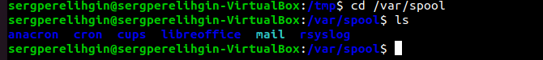
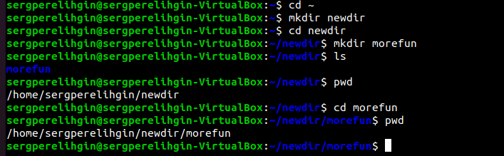
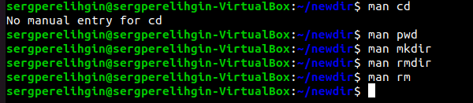
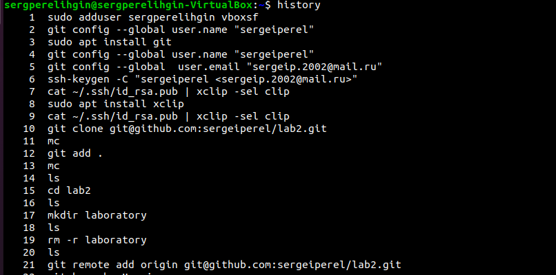
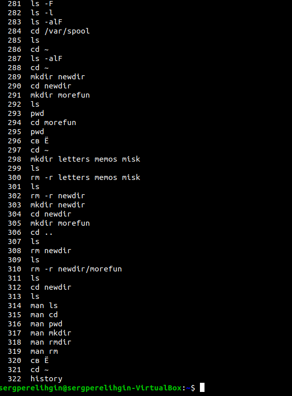
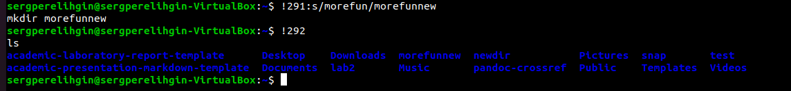

---
## Front matter
lang: ru-RU
title: Отчет по лабораторной работе №5
author: Перелыгин Сергей Викторович

## Formatting
mainfont: PT Serif
romanfont: PT Serif
sansfont: PT Sans
monofont: PT Mono
toc: false
slide_level: 2
theme: metropolis
aspectratio: 43
section-titles: true
---

# Цель работы

## Цель лабораторной работы

Приобретение практических навыков взаимодействия пользователя с системой посредством командной строки.

# Выполнение лабораторной работы

## Начало выполнения работы
- Переходим в каталог /tmp, используякоманду cd /tmp.Выводим на экран содержимое каталога /tmp, используя команду ls с различными опциями: ls, ls -a, ls -F, ls -l, ls -alF.
- Затем определяем, есть ли в каталоге /var/spool подкаталог  с именем cron

{ #fig:007 width=70% }

---

- Далее создаем  новый  каталог newdir, в нем создаем каталог morefun

{ #fig:009 width=70% }

- Пробуем удалить каталог newdir командой rm newdir и получаем отказ  в  выполнении  команды.

## Ознакомление с командой man
Используя  команду  man ls,  определяю,  какую  опцию  команды ls необходимо  использовать,  чтобы  просмотреть  содержимое  не  только указанного каталога, но и подкаталогов, входящих в него(Рисунки 12, 13).

{ #fig:012 width=70% }

## Просмотр описания команд cd,pwd,mkdir,rmdir,rm

Используя команды man cd, man pwd, man mkdir, man rmdir, man rm, просматриваю описание соответствующих команд(Рисунок 17). Команда cd не имеет дополнительных опций.

{ #fig:0017 width=70% }

## Команда history

Выведем историю команд с помощью команды history(Рисунки 18, 19). Далее,  используя  команды, !291:s/morefun/morefunnew и  !292, выполним  команды  291  и  292  (в  291 будет  создан  каталог morefunnew вместо morefun)(Рисунок 20).

{ #fig:018 width=70% }

---

{ #fig:019 width=70% }

---

{ #fig:020 width=70% }

# Выводы
## Вывод

в ходе выполнения данной лабораторной работы я приобретел практические навыки взаимодействия пользователя с системой посредством командной строки.

---
Спасибо за внимание!
