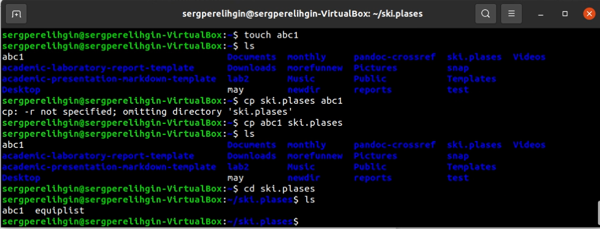
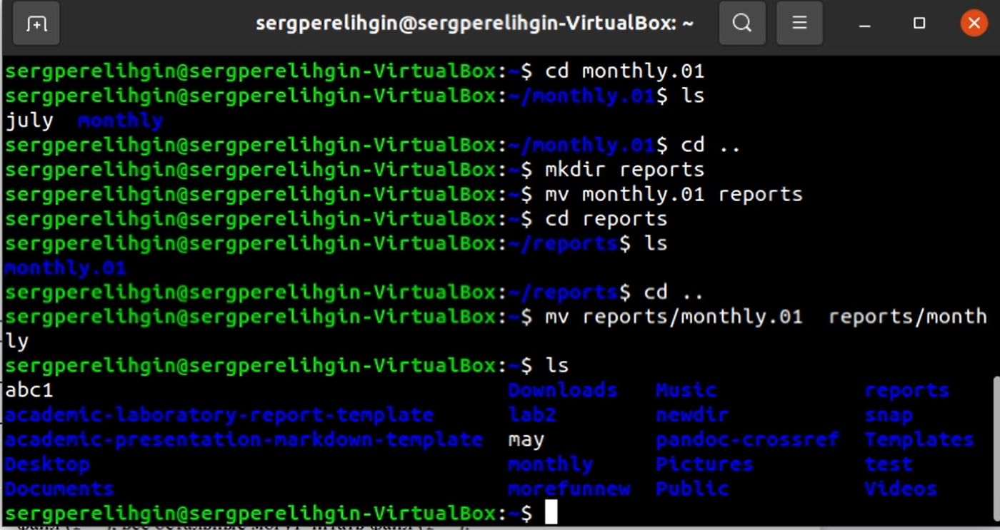

---
## Front matter
lang: ru-RU
title: Отчет по лабораторной работе №6
author: Перелыгин Сергей Викторович

## Formatting
mainfont: PT Serif
romanfont: PT Serif
sansfont: PT Sans
monofont: PT Mono
toc: false
slide_level: 2
theme: metropolis
aspectratio: 43
section-titles: true
---

# Цель работы

## Цель лабораторной работы

Ознакомление с файловой системой Linux, её структурой, именами и содержанием каталогов. Приобретение практических навыков по  применению  команд  для  работы  с  файлами  и  каталогами,  по управлению процессами (и работами), по проверке использования диска и обслуживанию файловой системы.

# Выполнение лабораторной работы

## Начало выполнения работы
1. Для начала выполним примеры, описанные в первой части описания лабораторнойработы.Рисунок 1 и 2:
   1) Скопируем  файл  ~/abc1  в  файл  april и  в  файл may.  Для  этого создадим  файл abc1,  используя  команду  «touch abc1»,  далее осуществим копирование с помощью команд «cp abc1 april» и «cp abc1 may».
   2) Скопируем файлы april и may в каталог monthly, используя команды «mkdir monthly»  -  для  создания  каталога monthly и  «cp april may monthly» для копирования.
   3) Скопируем  файл  monthly/may  в  файл  с  именем  june.  Выполним команды «cp monthly/may monthly/june» и «ls monthly» (для просмотра содержимого каталога)
   4) Скопируем каталог monthly в каталог monthly.00. Для этого создадим каталог monthly.00 командой  «mkdir monthly.00» и  осуществим копирование, используя команду «cp -r monthly monthly.00»(команда cp  с  опцией  r  (recursive)  позволяет  копировать  каталоги  вместе  с входящими в них файлами и каталогами).
---
   5) Скопируем каталог monthly.00 в каталог /tmp, используя команду «cp -r monthly.00 /tmp».

{ #fig:001 width=70% }

---

{ #fig:002 width=70% }

---

- Далее создаем  новый  каталог newdir, в нем создаем каталог morefun

{ #fig:003 width=70% }

- Пробуем удалить каталог newdir командой rm newdir и получаем отказ  в  выполнении  команды.

## Рисунок 3 и 4:
1. Изменим  название  файла  april на  july  в  домашнем  каталоге, используя команду «mv april july».

2. Переместим  файл  july  в  каталог  monthly.00  с  помощью  команды «mv julymonthly.00». Проверим результат командой «ls monthly.00»
.
3. Переименуем  каталог monthly.00  в  monthly.01,  используя  команду «mv monthly.00 monthly.01».

4. Переместим каталог  monthly.01 в  каталог  reports.  Для  этого создадим  каталог reports с  помощью  команды  «mkdir  reports»  и выполним перемещение командой «mv monthly.01 reports».

5. Переименуем каталог reports/monthly.01 в reports/monthly командой «mv reports/monthly.01 reports/monthly».

---

{ #fig:004 width=70% }
---

{ #fig:005 width=70% }

## Рисунки 5 и 6:

1.  Создадим файл  ~/may  с  правом  выполнения  для  владельца.  Для этого выполним следующие команды: «touchmay» (создание файла), «ls -l may» (просмотр сведений о файле), «chmod u+x may» (изменение прав), «ls -l may».

2. Лишаемвладельца файла  ~/may  права  на  выполнение,  используя команды:  «chmod  u-x  may»  (изменение  прав),  «ls -l  may»  (просмотр сведений о файле).

3. Создаем каталог monthly с запретом на чтение для членов группы и всех остальных пользователей. Выполняем команды: «mkdir  monthly»(создание каталога), «chmod go -r monthly»(изменение прав).

4. Создаем файл ~/abc1 с правом записи для членов группы, используя команды:  «touchabc1»,  «chmod g+w abc1».
---

{ #fig:005 width=70% }

---

{ #fig:006 width=70% }

## Выполняем следующие действия, отображенные на Рисунках 7-13:

1. Копируе мфайл /usr/include/aio.h (т.к. у  меня  нет  каталога /usr/include/sys/, то беру произвольный файл из каталога /usr/include) в домашний каталог(команда «cp/usr/include/aio.h ~») 
и называем его equipment(команда «mv aio.h equipment»). 
2. В  домашнем  каталоге  создаем директорию  ~/ski.plases(команда «mkdir ski.plases»). 
3. Перемещаем файл  equipment  в  каталог  ~/ski.plases(команда  «mv equipment ski.plases»). 
4. Переименовываем файл ~/ski.plases/equipment в ~/ski.plases equiplist(команда «mv ski.plases/equipment ski.plases/equiplist»). 
5. Создаем в домашнем каталоге файл abc1(команда «touch abc1») и копируем его в каталог ~/ski.plases(команда«cp abc1 ski.plases»), называем его equiplist2(команда «mv ski.plases/abc1 ski.plases/equiplist2»). 

---
6. Создаем каталог с именем equipment в каталоге ~/ski.plases(команда«mk dir ski.plases/equipment»). 
7. Перемещаем файлы ~/ski.plases/equiplist и equiplist2 в каталог ~/ski.plases/equipment(команда «mv ski.plases/equiplist ski.plases/equiplist2 ski.plases/equipment»). 
8. Создаем(команда«mkdir newdir») и перемещаем каталог ~/newdir в каталог ~/ski.plases(команда «mv newdir ski.plases») и называем его plans(команда«mv ski.plases/newdir ski.plases/plans»).

---

{ #fig:007 width=70% }

---

{ #fig:008 width=70% }

---

{ #fig:009 width=70% }

---

{ #fig:010 width=70% }

---

{ #fig:011 width=70% }

---

{ #fig:012 width=70% }

---

{ #fig:013 width=70% }

## Выполняем следующие действия, отображенные на Рисунках 16-17:

1. Просмотрим содержимое   файла   /etc/passwd   (команда   «cat/etc/passwd»).
2. Копируем файл  ~/feathers  в  файл  ~/file.old(команда «cp feathers file.old»). 
3. Переместим файл  ~/file.old  в  каталог  ~/play(команда  «mv file.old play»). 
4. Скопируем каталог ~/play в каталог ~/fun(команда «cp-r play fun»). 
5. Переместим каталог ~/fun в каталог ~/play(команда «mv fun play») и назовем его games(команда «mv play/fun play/games»). 
6. Лишим владельца файла ~/feathers права на чтение(команда «chmod
u-r feathers»). 

---

7. Если мы попытаемся просмотреть файл ~/feathers командой cat, то получим  отказ  в  доступе,  т.к.  в  предыдущем пункте лишили владельца права на чтение данного файла.
8. Если  мы  попытаемся  скопировать  файл  ~/feathers,  например,  в каталог monthly,  то  получим  отказ  в доступе, по  причине, описанной в предыдущем пункте. 
9. Дадим владельцу файла ~/feathers право на чтение (команда «chmod u+r feathers»).
10. Лишим владельца  каталога  ~/play  права  на  выполнение(команда «chmod u-x play»). 
11. Перейдем в  каталог  ~/play(команда  «cd play»).  Получим  отказ  в доступе,  т.к.  в  предыдущем  пункте  лишили  владельца  права  на выполнение данного каталога.
12. Дадим владельцу  каталога  ~/play  право  на  выполнение(команда «chmod u+x play»).

---

{ #fig:016 width=70% }

---

{ #fig:017 width=70% }

# Выводы

## Вывод

В ходе выполнения данной лабораторной работы я ознакомился файловой  системой  Linux,  её  структурой,  именами  и  содержанием каталогов,  получил  навыки по  применению  команд  для  работы  с файлами  и  каталогами,  по  управлению  процессами  (и  работами),  по проверке использования диска и обслуживанию файловой системы.

---
Спасибо за внимание!
