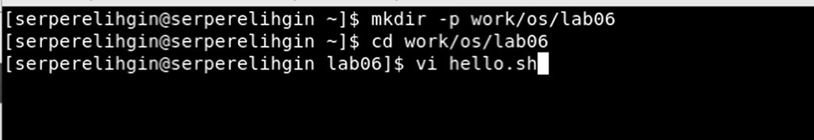
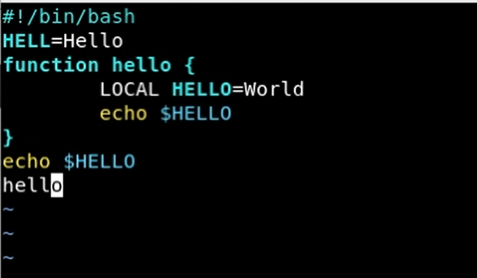
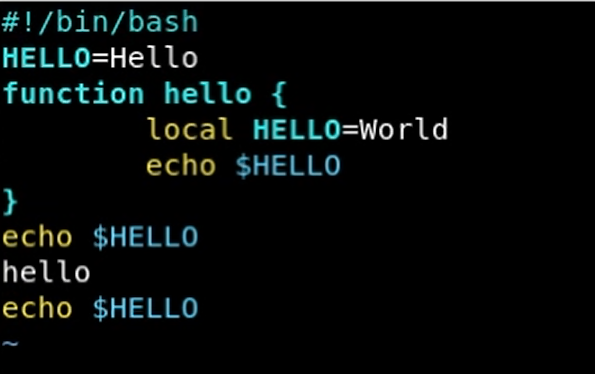
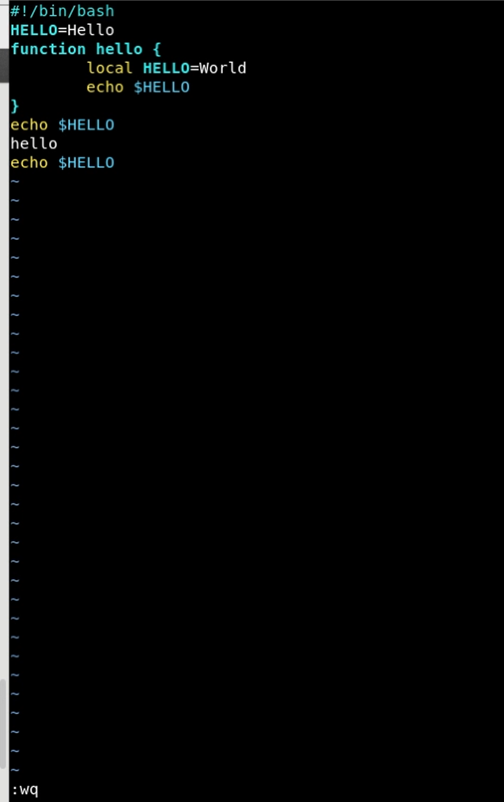

---
## Front matter
lang: ru-RU
title: Отчет по лабораторной работе №9
author: Перелыгин Сергей Викторович

## Formatting
mainfont: PT Serif
romanfont: PT Serif
sansfont: PT Sans
monofont: PT Mono
toc: false
slide_level: 2
theme: metropolis
aspectratio: 43
section-titles: true
---

# Цель работы

## Цель лабораторной работы

Познакомиться с операционной системой Linux. Получить практические навы-ки работы с редактором vi, установленным по умолчанию практически во всех дистрибутивах.

# Выполнение лабораторной работы

## Выполнение лабораторной работы

Сначала создадим каталог work/os/lab06, перейдем в него и вызовем редактор vi при помощи команды vi hello.sh

{ #fig:001 width=70% }

## Выполнение лабораторной работы

Далее ознакамливаемся с редактором vi, изучаем, как вводить текст, переходить в командный режим, переходить в режим последней строки, записывать, выходить и сохранять текст. А также научился удалять и отменять последние команды и т.д.

{ #fig:002 width=70% }

---

{ #fig:003 width=70% }

---

{ #fig:004 width=70% }

# Выводы

## Выводы

в ходе выполнения данной лабораторной работы я ознакомился с операционной системой Linux, получил практические навыки работы с редактором vi, установленным по умолчанию практически во всех дис-трибутивах.

---
Спасибо за внимание!
